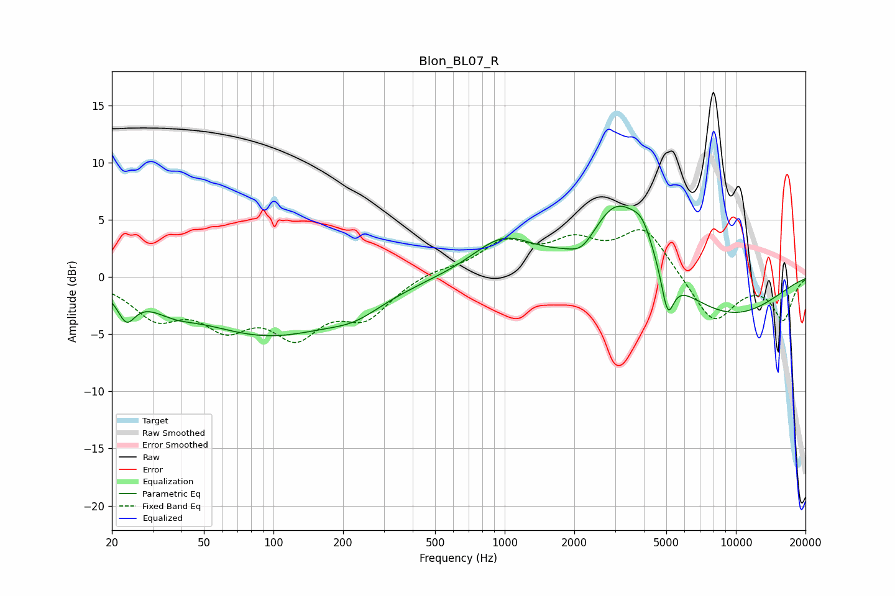

# Blon_BL07_R
See [usage instructions](https://github.com/jaakkopasanen/AutoEq#usage) for more options and info.

### Parametric EQs
Apply preamp of -6.3 dB when using parametric equalizer.

|   # | Type    |   Fc (Hz) |    Q |   Gain (dB) |
|-----|---------|-----------|------|-------------|
|   1 | Peaking |        23 | 3.82 |        -2.3 |
|   2 | Peaking |        37 | 1.53 |        -0.9 |
|   3 | Peaking |        95 | 0.44 |        -4.9 |
|   4 | Peaking |       226 | 1.2  |        -1.2 |
|   5 | Peaking |       985 | 1.04 |         3.2 |
|   6 | Peaking |      2165 | 2.55 |        -1.3 |
|   7 | Peaking |      3079 | 1.16 |         6.7 |
|   8 | Peaking |      3944 | 3.09 |         2   |
|   9 | Peaking |      5070 | 5.22 |        -3.8 |
|  10 | Peaking |      9136 | 0.51 |        -3.5 |

### Fixed Band EQs
When using fixed band (also called graphic) equalizer, apply preamp of **-4.2 dB** (if available) and set gains manually with these parameters.

|   # | Type    |   Fc (Hz) |    Q |   Gain (dB) |
|-----|---------|-----------|------|-------------|
|   1 | Peaking |        31 | 1.41 |        -3.2 |
|   2 | Peaking |        62 | 1.41 |        -3.6 |
|   3 | Peaking |       125 | 1.41 |        -4.4 |
|   4 | Peaking |       250 | 1.41 |        -3.1 |
|   5 | Peaking |       500 | 1.41 |         0.6 |
|   6 | Peaking |      1000 | 1.41 |         2.8 |
|   7 | Peaking |      2000 | 1.41 |         2.6 |
|   8 | Peaking |      4000 | 1.41 |         4.2 |
|   9 | Peaking |      8000 | 1.41 |        -4.1 |
|  10 | Peaking |     16000 | 1.41 |        -3.7 |

### Graphs

