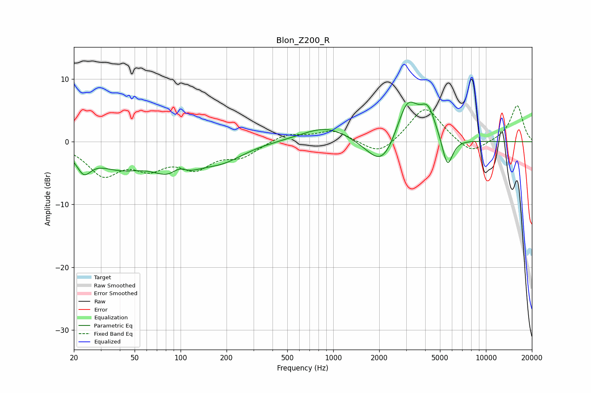

# Blon_Z200_R
See [usage instructions](https://github.com/jaakkopasanen/AutoEq#usage) for more options and info.

### Parametric EQs
Apply preamp of -6.4 dB when using parametric equalizer.

|   # | Type    |   Fc (Hz) |    Q |   Gain (dB) |
|-----|---------|-----------|------|-------------|
|   1 | Peaking |        23 | 2.99 |        -3.1 |
|   2 | Peaking |        39 | 0.85 |        -3.4 |
|   3 | Peaking |        94 | 1.15 |        -5.3 |
|   4 | Peaking |        97 | 2.54 |         2.5 |
|   5 | Peaking |       190 | 1    |        -2.3 |
|   6 | Peaking |       904 | 0.87 |         2.5 |
|   7 | Peaking |      2098 | 1.41 |        -5.3 |
|   8 | Peaking |      3057 | 1.89 |         7.3 |
|   9 | Peaking |      4176 | 2.75 |         4.3 |
|  10 | Peaking |      5593 | 4    |        -5   |

### Fixed Band EQs
When using fixed band (also called graphic) equalizer, apply preamp of **-5.8 dB** (if available) and set gains manually with these parameters.

|   # | Type    |   Fc (Hz) |    Q |   Gain (dB) |
|-----|---------|-----------|------|-------------|
|   1 | Peaking |        31 | 1.41 |        -4.9 |
|   2 | Peaking |        62 | 1.41 |        -3.4 |
|   3 | Peaking |       125 | 1.41 |        -3.6 |
|   4 | Peaking |       250 | 1.41 |        -2.1 |
|   5 | Peaking |       500 | 1.41 |         1.3 |
|   6 | Peaking |      1000 | 1.41 |         1.8 |
|   7 | Peaking |      2000 | 1.41 |        -2.4 |
|   8 | Peaking |      4000 | 1.41 |         5.7 |
|   9 | Peaking |      8000 | 1.41 |        -2.2 |
|  10 | Peaking |     16000 | 1.41 |         5.8 |

### Graphs

