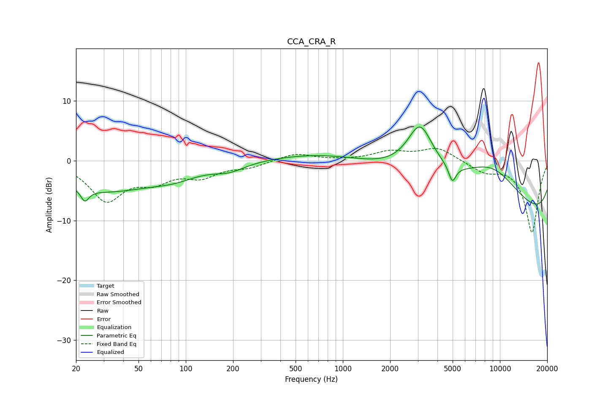

# CCA_CRA_R
See [usage instructions](https://github.com/jaakkopasanen/AutoEq#usage) for more options and info.

### Parametric EQs
Apply preamp of -5.7 dB when using parametric equalizer.

|   # | Type    |   Fc (Hz) |    Q |   Gain (dB) |
|-----|---------|-----------|------|-------------|
|   1 | Peaking |        23 | 5.56 |        -2   |
|   2 | Peaking |        23 | 0.55 |        -2.3 |
|   3 | Peaking |        42 | 0.44 |        -3.1 |
|   4 | Peaking |        86 | 1.05 |        -1.1 |
|   5 | Peaking |       190 | 1.44 |        -1.3 |
|   6 | Peaking |      1500 | 0.31 |         3   |
|   7 | Peaking |      3099 | 1.66 |         8.4 |
|   8 | Peaking |      4978 | 6    |        -2.8 |
|   9 | Peaking |      8822 | 0.44 |        13.5 |
|  10 | Peaking |     10000 | 0.18 |       -15.8 |

### Fixed Band EQs
When using fixed band (also called graphic) equalizer, apply preamp of **-2.1 dB** (if available) and set gains manually with these parameters.

|   # | Type    |   Fc (Hz) |    Q |   Gain (dB) |
|-----|---------|-----------|------|-------------|
|   1 | Peaking |        31 | 1.41 |        -6.4 |
|   2 | Peaking |        62 | 1.41 |        -2.8 |
|   3 | Peaking |       125 | 1.41 |        -2.3 |
|   4 | Peaking |       250 | 1.41 |        -1   |
|   5 | Peaking |       500 | 1.41 |         1.2 |
|   6 | Peaking |      1000 | 1.41 |         0   |
|   7 | Peaking |      2000 | 1.41 |         1.4 |
|   8 | Peaking |      4000 | 1.41 |         2.1 |
|   9 | Peaking |      8000 | 1.41 |        -1.7 |
|  10 | Peaking |     16000 | 1.41 |       -12   |

### Graphs

