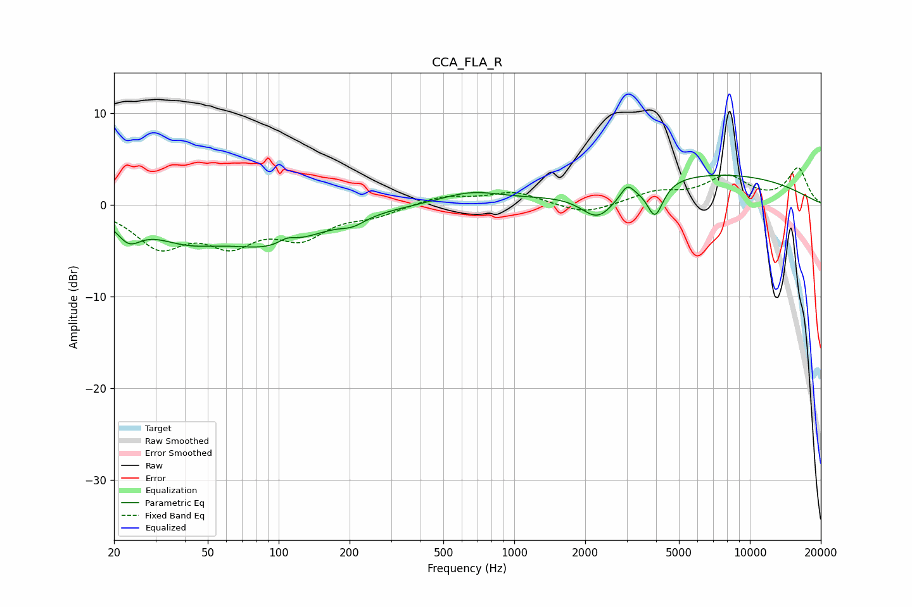

# CCA_FLA_R
See [usage instructions](https://github.com/jaakkopasanen/AutoEq#usage) for more options and info.

### Parametric EQs
Apply preamp of -3.3 dB when using parametric equalizer.

|   # | Type    |   Fc (Hz) |    Q |   Gain (dB) |
|-----|---------|-----------|------|-------------|
|   1 | Peaking |        23 | 2.71 |        -2.4 |
|   2 | Peaking |        40 | 0.88 |        -2.9 |
|   3 | Peaking |        97 | 0.7  |        -3.9 |
|   4 | Peaking |       109 | 3.69 |         0.7 |
|   5 | Peaking |       206 | 2.76 |        -0.8 |
|   6 | Peaking |       654 | 1.06 |         1.3 |
|   7 | Peaking |      2266 | 1.95 |        -3.1 |
|   8 | Peaking |      3018 | 5.56 |         1.2 |
|   9 | Peaking |      3959 | 4.12 |        -3.7 |
|  10 | Peaking |      6684 | 0.3  |         3.4 |

### Fixed Band EQs
When using fixed band (also called graphic) equalizer, apply preamp of **-4.1 dB** (if available) and set gains manually with these parameters.

|   # | Type    |   Fc (Hz) |    Q |   Gain (dB) |
|-----|---------|-----------|------|-------------|
|   1 | Peaking |        31 | 1.41 |        -4.2 |
|   2 | Peaking |        62 | 1.41 |        -3.6 |
|   3 | Peaking |       125 | 1.41 |        -3.2 |
|   4 | Peaking |       250 | 1.41 |        -1   |
|   5 | Peaking |       500 | 1.41 |         1   |
|   6 | Peaking |      1000 | 1.41 |         1.3 |
|   7 | Peaking |      2000 | 1.41 |        -1.1 |
|   8 | Peaking |      4000 | 1.41 |         1.2 |
|   9 | Peaking |      8000 | 1.41 |         2.9 |
|  10 | Peaking |     16000 | 1.41 |         3.9 |

### Graphs

