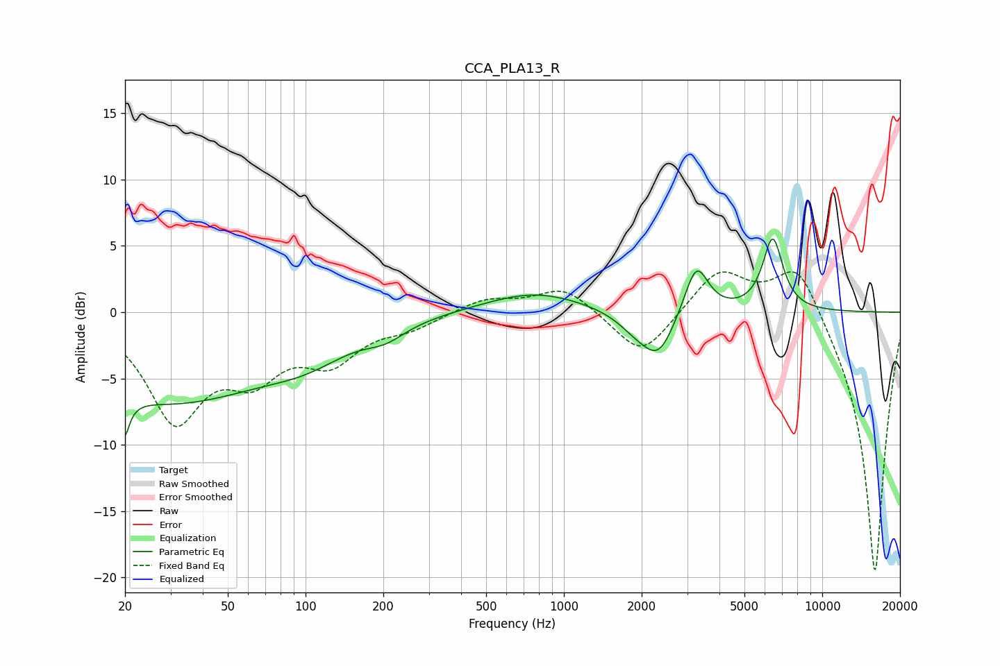

# CCA_PLA13_R
See [usage instructions](https://github.com/jaakkopasanen/AutoEq#usage) for more options and info.

### Parametric EQs
Apply preamp of -5.6 dB when using parametric equalizer.

|   # | Type    |   Fc (Hz) |    Q |   Gain (dB) |
|-----|---------|-----------|------|-------------|
|   1 | Peaking |        20 | 5.94 |        -6.3 |
|   2 | Peaking |        20 | 5.92 |         3.2 |
|   3 | Peaking |        29 | 0.34 |        -6.6 |
|   4 | Peaking |       102 | 0.88 |        -1.6 |
|   5 | Peaking |       204 | 1.83 |        -0.9 |
|   6 | Peaking |       769 | 0.74 |         1.6 |
|   7 | Peaking |      1918 | 1.87 |        -1.2 |
|   8 | Peaking |      2334 | 2.27 |        -3   |
|   9 | Peaking |      3257 | 3.08 |         3.8 |
|  10 | Peaking |      6430 | 3.53 |         5.5 |

### Fixed Band EQs
When using fixed band (also called graphic) equalizer, apply preamp of **-3.1 dB** (if available) and set gains manually with these parameters.

|   # | Type    |   Fc (Hz) |    Q |   Gain (dB) |
|-----|---------|-----------|------|-------------|
|   1 | Peaking |        31 | 1.41 |        -7.8 |
|   2 | Peaking |        62 | 1.41 |        -3.9 |
|   3 | Peaking |       125 | 1.41 |        -3.2 |
|   4 | Peaking |       250 | 1.41 |        -1   |
|   5 | Peaking |       500 | 1.41 |         1   |
|   6 | Peaking |      1000 | 1.41 |         1.9 |
|   7 | Peaking |      2000 | 1.41 |        -3.5 |
|   8 | Peaking |      4000 | 1.41 |         3.3 |
|   9 | Peaking |      8000 | 1.41 |         4.3 |
|  10 | Peaking |     16000 | 1.41 |       -19.9 |

### Graphs

