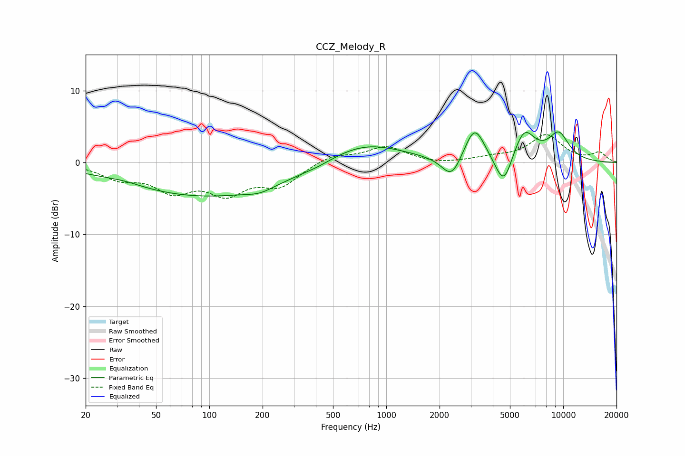

# CCZ_Melody_R
See [usage instructions](https://github.com/jaakkopasanen/AutoEq#usage) for more options and info.

### Parametric EQs
Apply preamp of -4.4 dB when using parametric equalizer.

|   # | Type    |   Fc (Hz) |    Q |   Gain (dB) |
|-----|---------|-----------|------|-------------|
|   1 | Peaking |        33 | 1.52 |         0.4 |
|   2 | Peaking |        98 | 0.29 |        -4.7 |
|   3 | Peaking |       193 | 1.92 |        -0.7 |
|   4 | Peaking |       410 | 1.64 |        -0.3 |
|   5 | Peaking |       740 | 0.65 |         3   |
|   6 | Peaking |      2342 | 2.55 |        -3.3 |
|   7 | Peaking |      3155 | 2.45 |         5   |
|   8 | Peaking |      4609 | 2.86 |        -4.7 |
|   9 | Peaking |      6001 | 2.23 |         4.4 |
|  10 | Peaking |      9430 | 2.08 |         3.7 |

### Fixed Band EQs
When using fixed band (also called graphic) equalizer, apply preamp of **-4.0 dB** (if available) and set gains manually with these parameters.

|   # | Type    |   Fc (Hz) |    Q |   Gain (dB) |
|-----|---------|-----------|------|-------------|
|   1 | Peaking |        31 | 1.41 |        -1.9 |
|   2 | Peaking |        62 | 1.41 |        -3.5 |
|   3 | Peaking |       125 | 1.41 |        -3.8 |
|   4 | Peaking |       250 | 1.41 |        -3   |
|   5 | Peaking |       500 | 1.41 |         1.1 |
|   6 | Peaking |      1000 | 1.41 |         2.1 |
|   7 | Peaking |      2000 | 1.41 |        -0.3 |
|   8 | Peaking |      4000 | 1.41 |         0.6 |
|   9 | Peaking |      8000 | 1.41 |         3.7 |
|  10 | Peaking |     16000 | 1.41 |         1.3 |

### Graphs

