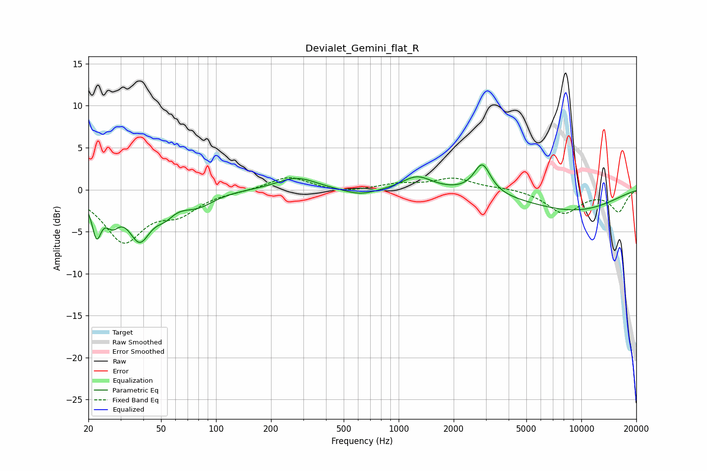

# Devialet_Gemini_flat_R
See [usage instructions](https://github.com/jaakkopasanen/AutoEq#usage) for more options and info.

### Parametric EQs
Apply preamp of -3.0 dB when using parametric equalizer.

|   # | Type    |   Fc (Hz) |    Q |   Gain (dB) |
|-----|---------|-----------|------|-------------|
|   1 | Peaking |        22 | 5.67 |        -4.3 |
|   2 | Peaking |        27 | 3.74 |        -2.4 |
|   3 | Peaking |        38 | 2.31 |        -5.3 |
|   4 | Peaking |        52 | 2.69 |        -1.5 |
|   5 | Peaking |        79 | 1.57 |        -1.7 |
|   6 | Peaking |       276 | 1.32 |         1.5 |
|   7 | Peaking |       616 | 1.54 |        -0.8 |
|   8 | Peaking |      1262 | 1.75 |         1.7 |
|   9 | Peaking |      2869 | 3.13 |         3.5 |
|  10 | Peaking |      8933 | 0.48 |        -2.4 |

### Fixed Band EQs
When using fixed band (also called graphic) equalizer, apply preamp of **-1.5 dB** (if available) and set gains manually with these parameters.

|   # | Type    |   Fc (Hz) |    Q |   Gain (dB) |
|-----|---------|-----------|------|-------------|
|   1 | Peaking |        31 | 1.41 |        -6   |
|   2 | Peaking |        62 | 1.41 |        -2.4 |
|   3 | Peaking |       125 | 1.41 |        -0.1 |
|   4 | Peaking |       250 | 1.41 |         1.6 |
|   5 | Peaking |       500 | 1.41 |        -0.4 |
|   6 | Peaking |      1000 | 1.41 |         0.6 |
|   7 | Peaking |      2000 | 1.41 |         1.3 |
|   8 | Peaking |      4000 | 1.41 |         0.2 |
|   9 | Peaking |      8000 | 1.41 |        -2.8 |
|  10 | Peaking |     16000 | 1.41 |        -2.5 |

### Graphs

