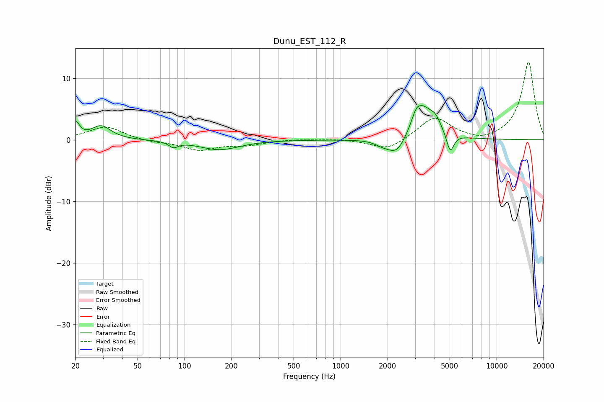

# Dunu_EST_112_R
See [usage instructions](https://github.com/jaakkopasanen/AutoEq#usage) for more options and info.

### Parametric EQs
Apply preamp of -5.6 dB when using parametric equalizer.

|   # | Type    |   Fc (Hz) |    Q |   Gain (dB) |
|-----|---------|-----------|------|-------------|
|   1 | Peaking |        20 | 5.89 |         2.5 |
|   2 | Peaking |        29 | 2.3  |         2.2 |
|   3 | Peaking |        85 | 4.86 |        -0.9 |
|   4 | Peaking |       167 | 1.11 |        -1.6 |
|   5 | Peaking |      1841 | 3.2  |        -0.5 |
|   6 | Peaking |      2302 | 2.22 |        -3.2 |
|   7 | Peaking |      3049 | 5.98 |         1.1 |
|   8 | Peaking |      3316 | 1.93 |         5.6 |
|   9 | Peaking |      4069 | 4.19 |         1.5 |
|  10 | Peaking |      5040 | 5.98 |        -3.2 |

### Fixed Band EQs
When using fixed band (also called graphic) equalizer, apply preamp of **-12.7 dB** (if available) and set gains manually with these parameters.

|   # | Type    |   Fc (Hz) |    Q |   Gain (dB) |
|-----|---------|-----------|------|-------------|
|   1 | Peaking |        31 | 1.41 |         2.2 |
|   2 | Peaking |        62 | 1.41 |        -0.4 |
|   3 | Peaking |       125 | 1.41 |        -1.6 |
|   4 | Peaking |       250 | 1.41 |        -0.8 |
|   5 | Peaking |       500 | 1.41 |         0.1 |
|   6 | Peaking |      1000 | 1.41 |         0.1 |
|   7 | Peaking |      2000 | 1.41 |        -1.8 |
|   8 | Peaking |      4000 | 1.41 |         3.7 |
|   9 | Peaking |      8000 | 1.41 |        -0.6 |
|  10 | Peaking |     16000 | 1.41 |        12.7 |

### Graphs

