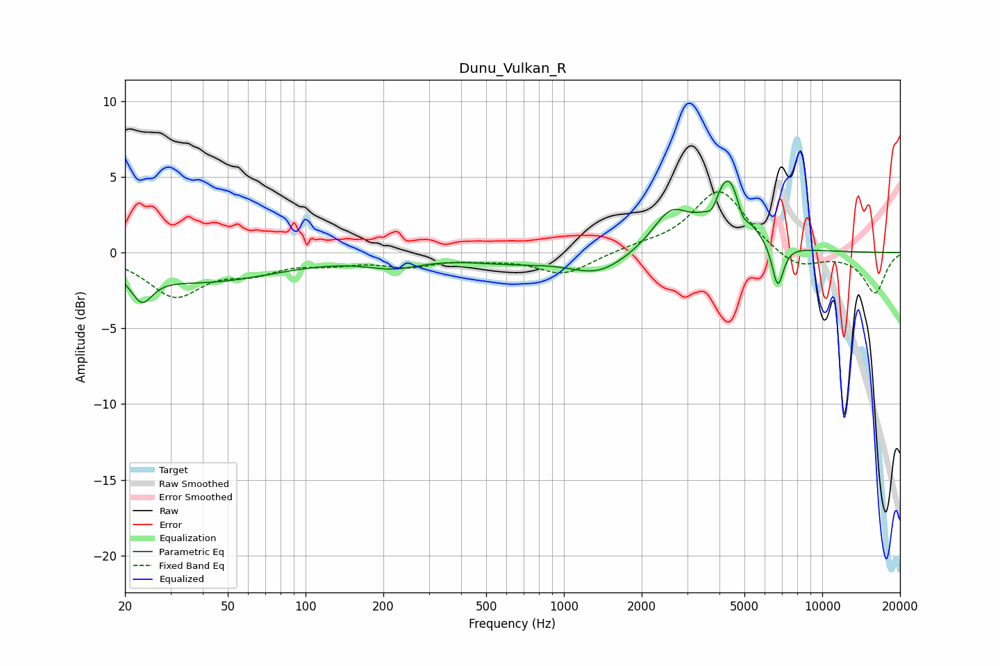

# Dunu_Vulkan_R
See [usage instructions](https://github.com/jaakkopasanen/AutoEq#usage) for more options and info.

### Parametric EQs
Apply preamp of -4.8 dB when using parametric equalizer.

|   # | Type    |   Fc (Hz) |    Q |   Gain (dB) |
|-----|---------|-----------|------|-------------|
|   1 | Peaking |        23 | 3.47 |        -1.9 |
|   2 | Peaking |        40 | 0.49 |        -1.9 |
|   3 | Peaking |       219 | 1.31 |        -0.7 |
|   4 | Peaking |       625 | 0.84 |        -0.5 |
|   5 | Peaking |      1361 | 1.27 |        -1.4 |
|   6 | Peaking |      2592 | 1.96 |         2.5 |
|   7 | Peaking |      3758 | 5.89 |        -1   |
|   8 | Peaking |      4331 | 2.19 |         5   |
|   9 | Peaking |      4917 | 6    |        -1.2 |
|  10 | Peaking |      6727 | 6    |        -2.9 |

### Fixed Band EQs
When using fixed band (also called graphic) equalizer, apply preamp of **-4.1 dB** (if available) and set gains manually with these parameters.

|   # | Type    |   Fc (Hz) |    Q |   Gain (dB) |
|-----|---------|-----------|------|-------------|
|   1 | Peaking |        31 | 1.41 |        -2.8 |
|   2 | Peaking |        62 | 1.41 |        -1   |
|   3 | Peaking |       125 | 1.41 |        -0.5 |
|   4 | Peaking |       250 | 1.41 |        -0.8 |
|   5 | Peaking |       500 | 1.41 |        -0.3 |
|   6 | Peaking |      1000 | 1.41 |        -1.4 |
|   7 | Peaking |      2000 | 1.41 |         0.3 |
|   8 | Peaking |      4000 | 1.41 |         4.2 |
|   9 | Peaking |      8000 | 1.41 |        -1.1 |
|  10 | Peaking |     16000 | 1.41 |        -2.7 |

### Graphs

