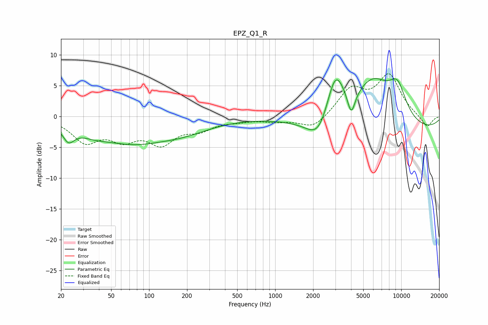

# EPZ_Q1_R
See [usage instructions](https://github.com/jaakkopasanen/AutoEq#usage) for more options and info.

### Parametric EQs
Apply preamp of -6.3 dB when using parametric equalizer.

|   # | Type    |   Fc (Hz) |    Q |   Gain (dB) |
|-----|---------|-----------|------|-------------|
|   1 | Peaking |        23 | 2.97 |        -2.6 |
|   2 | Peaking |        36 | 1.14 |        -1.3 |
|   3 | Peaking |        72 | 0.57 |        -3.5 |
|   4 | Peaking |       186 | 0.61 |        -2   |
|   5 | Peaking |      2232 | 1.52 |        -4.4 |
|   6 | Peaking |      2996 | 1.86 |         8.1 |
|   7 | Peaking |      4012 | 4.47 |        -4   |
|   8 | Peaking |      5964 | 0.88 |         7.5 |
|   9 | Peaking |      8279 | 0.18 |        -2.7 |
|  10 | Peaking |      9342 | 1.79 |         4.8 |

### Fixed Band EQs
When using fixed band (also called graphic) equalizer, apply preamp of **-7.0 dB** (if available) and set gains manually with these parameters.

|   # | Type    |   Fc (Hz) |    Q |   Gain (dB) |
|-----|---------|-----------|------|-------------|
|   1 | Peaking |        31 | 1.41 |        -3.8 |
|   2 | Peaking |        62 | 1.41 |        -3.1 |
|   3 | Peaking |       125 | 1.41 |        -3.9 |
|   4 | Peaking |       250 | 1.41 |        -1.8 |
|   5 | Peaking |       500 | 1.41 |        -0.5 |
|   6 | Peaking |      1000 | 1.41 |        -0.6 |
|   7 | Peaking |      2000 | 1.41 |        -2.1 |
|   8 | Peaking |      4000 | 1.41 |         4.3 |
|   9 | Peaking |      8000 | 1.41 |         6.5 |
|  10 | Peaking |     16000 | 1.41 |        -1.9 |

### Graphs

