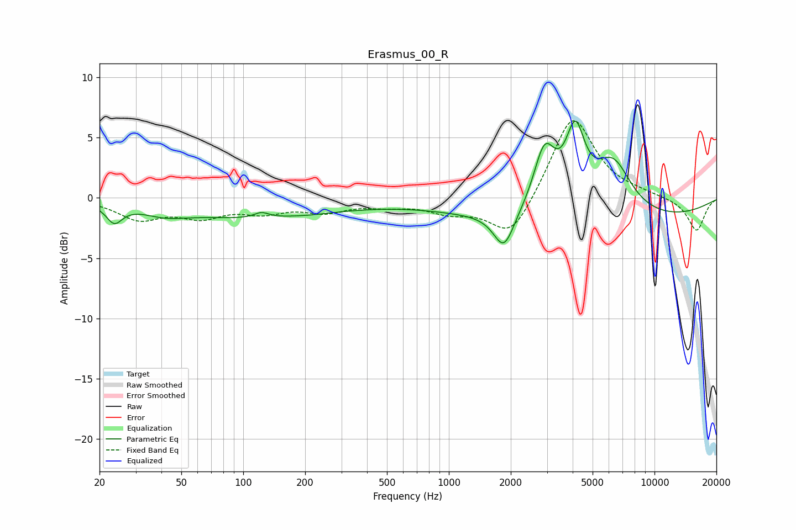

# Erasmus_00_R
See [usage instructions](https://github.com/jaakkopasanen/AutoEq#usage) for more options and info.

### Parametric EQs
Apply preamp of -6.5 dB when using parametric equalizer.

|   # | Type    |   Fc (Hz) |    Q |   Gain (dB) |
|-----|---------|-----------|------|-------------|
|   1 | Peaking |        24 | 3.67 |        -1.5 |
|   2 | Peaking |        41 | 1.38 |        -0.6 |
|   3 | Peaking |       112 | 0.35 |        -1.6 |
|   4 | Peaking |       123 | 4.01 |         0.5 |
|   5 | Peaking |       211 | 3.09 |        -0   |
|   6 | Peaking |      1853 | 2.87 |        -3   |
|   7 | Peaking |      2919 | 2.64 |         5.1 |
|   8 | Peaking |      4118 | 2.91 |         6   |
|   9 | Peaking |      4999 | 0.18 |        -2.1 |
|  10 | Peaking |      6279 | 1.52 |         4.5 |

### Fixed Band EQs
When using fixed band (also called graphic) equalizer, apply preamp of **-6.5 dB** (if available) and set gains manually with these parameters.

|   # | Type    |   Fc (Hz) |    Q |   Gain (dB) |
|-----|---------|-----------|------|-------------|
|   1 | Peaking |        31 | 1.41 |        -1.6 |
|   2 | Peaking |        62 | 1.41 |        -1.4 |
|   3 | Peaking |       125 | 1.41 |        -1   |
|   4 | Peaking |       250 | 1.41 |        -1   |
|   5 | Peaking |       500 | 1.41 |        -0.5 |
|   6 | Peaking |      1000 | 1.41 |        -1   |
|   7 | Peaking |      2000 | 1.41 |        -3.5 |
|   8 | Peaking |      4000 | 1.41 |         7   |
|   9 | Peaking |      8000 | 1.41 |         0.3 |
|  10 | Peaking |     16000 | 1.41 |        -2.8 |

### Graphs

