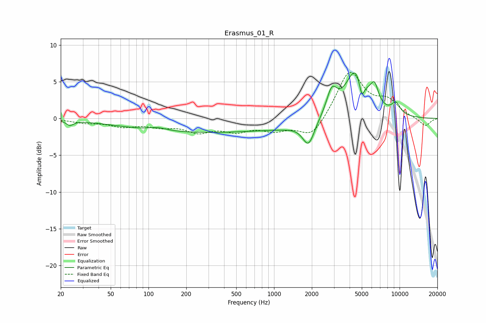

# Erasmus_01_R
See [usage instructions](https://github.com/jaakkopasanen/AutoEq#usage) for more options and info.

### Parametric EQs
Apply preamp of -6.3 dB when using parametric equalizer.

|   # | Type    |   Fc (Hz) |    Q |   Gain (dB) |
|-----|---------|-----------|------|-------------|
|   1 | Peaking |        24 | 5    |        -0.7 |
|   2 | Peaking |       119 | 1.99 |         0.4 |
|   3 | Peaking |       263 | 0.21 |        -1.9 |
|   4 | Peaking |      1294 | 0.91 |        -0.4 |
|   5 | Peaking |      1883 | 2.99 |        -3.3 |
|   6 | Peaking |      2882 | 3.37 |         3.2 |
|   7 | Peaking |      4524 | 1.68 |         6.8 |
|   8 | Peaking |      4997 | 6    |        -2.9 |
|   9 | Peaking |      6309 | 4.38 |         2.5 |
|  10 | Peaking |      9340 | 3.57 |         1.5 |

### Fixed Band EQs
When using fixed band (also called graphic) equalizer, apply preamp of **-6.4 dB** (if available) and set gains manually with these parameters.

|   # | Type    |   Fc (Hz) |    Q |   Gain (dB) |
|-----|---------|-----------|------|-------------|
|   1 | Peaking |        31 | 1.41 |        -0.5 |
|   2 | Peaking |        62 | 1.41 |        -0.9 |
|   3 | Peaking |       125 | 1.41 |        -0.9 |
|   4 | Peaking |       250 | 1.41 |        -1.6 |
|   5 | Peaking |       500 | 1.41 |        -1.4 |
|   6 | Peaking |      1000 | 1.41 |        -1.3 |
|   7 | Peaking |      2000 | 1.41 |        -2.7 |
|   8 | Peaking |      4000 | 1.41 |         6.5 |
|   9 | Peaking |      8000 | 1.41 |         2.1 |
|  10 | Peaking |     16000 | 1.41 |        -1.1 |

### Graphs

