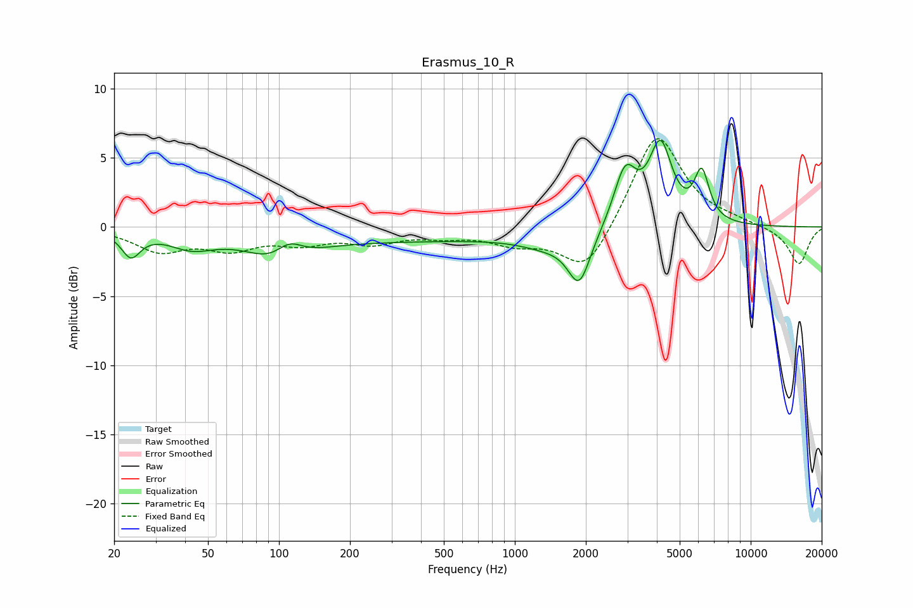

# Erasmus_10_R
See [usage instructions](https://github.com/jaakkopasanen/AutoEq#usage) for more options and info.

### Parametric EQs
Apply preamp of -6.4 dB when using parametric equalizer.

|   # | Type    |   Fc (Hz) |    Q |   Gain (dB) |
|-----|---------|-----------|------|-------------|
|   1 | Peaking |        24 | 3.57 |        -1.8 |
|   2 | Peaking |        43 | 1.49 |        -1.1 |
|   3 | Peaking |       102 | 1.22 |        -2.2 |
|   4 | Peaking |       110 | 2.25 |         1.7 |
|   5 | Peaking |       299 | 0.22 |        -0.9 |
|   6 | Peaking |      1376 | 1.19 |        -0.9 |
|   7 | Peaking |      1877 | 2.95 |        -3.6 |
|   8 | Peaking |      2937 | 2.93 |         4.1 |
|   9 | Peaking |      4143 | 2.88 |         5.6 |
|  10 | Peaking |      6202 | 4.39 |         3.5 |

### Fixed Band EQs
When using fixed band (also called graphic) equalizer, apply preamp of **-6.5 dB** (if available) and set gains manually with these parameters.

|   # | Type    |   Fc (Hz) |    Q |   Gain (dB) |
|-----|---------|-----------|------|-------------|
|   1 | Peaking |        31 | 1.41 |        -1.6 |
|   2 | Peaking |        62 | 1.41 |        -1.4 |
|   3 | Peaking |       125 | 1.41 |        -1   |
|   4 | Peaking |       250 | 1.41 |        -1   |
|   5 | Peaking |       500 | 1.41 |        -0.5 |
|   6 | Peaking |      1000 | 1.41 |        -1   |
|   7 | Peaking |      2000 | 1.41 |        -3.4 |
|   8 | Peaking |      4000 | 1.41 |         7   |
|   9 | Peaking |      8000 | 1.41 |         0.3 |
|  10 | Peaking |     16000 | 1.41 |        -2.7 |

### Graphs

