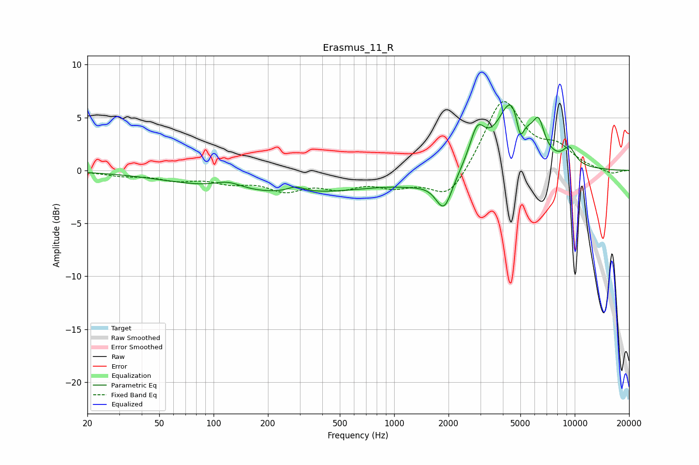

# Erasmus_11_R
See [usage instructions](https://github.com/jaakkopasanen/AutoEq#usage) for more options and info.

### Parametric EQs
Apply preamp of -6.3 dB when using parametric equalizer.

|   # | Type    |   Fc (Hz) |    Q |   Gain (dB) |
|-----|---------|-----------|------|-------------|
|   1 | Peaking |       120 | 1.78 |         0.7 |
|   2 | Peaking |       246 | 0.25 |        -2.2 |
|   3 | Peaking |       286 | 3.03 |         0.6 |
|   4 | Peaking |      1328 | 1.16 |        -0.6 |
|   5 | Peaking |      1890 | 3.02 |        -3.3 |
|   6 | Peaking |      2885 | 3.38 |         3.2 |
|   7 | Peaking |      4534 | 1.72 |         6.8 |
|   8 | Peaking |      4986 | 6    |        -2.9 |
|   9 | Peaking |      6311 | 4.47 |         2.6 |
|  10 | Peaking |      9322 | 3.59 |         1.5 |

### Fixed Band EQs
When using fixed band (also called graphic) equalizer, apply preamp of **-6.6 dB** (if available) and set gains manually with these parameters.

|   # | Type    |   Fc (Hz) |    Q |   Gain (dB) |
|-----|---------|-----------|------|-------------|
|   1 | Peaking |        31 | 1.41 |        -0.4 |
|   2 | Peaking |        62 | 1.41 |        -0.8 |
|   3 | Peaking |       125 | 1.41 |        -0.9 |
|   4 | Peaking |       250 | 1.41 |        -1.6 |
|   5 | Peaking |       500 | 1.41 |        -1.3 |
|   6 | Peaking |      1000 | 1.41 |        -1.2 |
|   7 | Peaking |      2000 | 1.41 |        -2.8 |
|   8 | Peaking |      4000 | 1.41 |         6.8 |
|   9 | Peaking |      8000 | 1.41 |         1.8 |
|  10 | Peaking |     16000 | 1.41 |        -0.4 |

### Graphs

