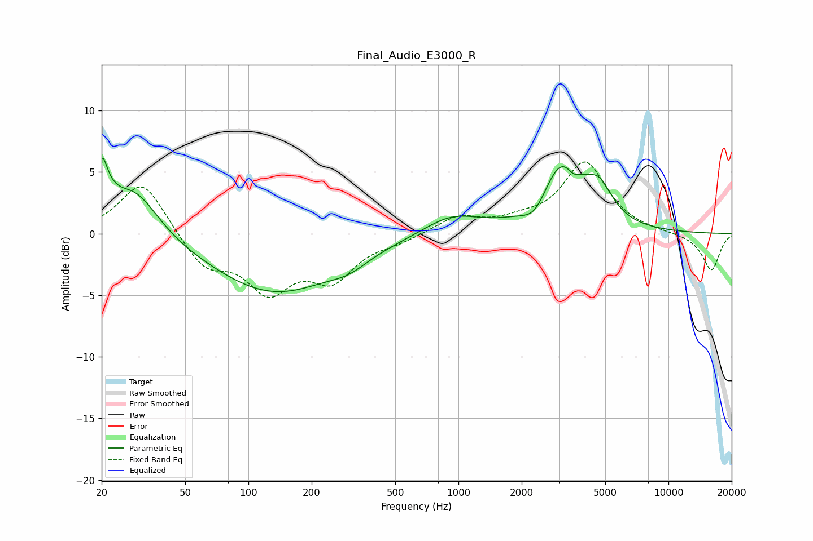

# Final_Audio_E3000_R
See [usage instructions](https://github.com/jaakkopasanen/AutoEq#usage) for more options and info.

### Parametric EQs
Apply preamp of -6.2 dB when using parametric equalizer.

|   # | Type    |   Fc (Hz) |    Q |   Gain (dB) |
|-----|---------|-----------|------|-------------|
|   1 | Peaking |        20 | 5.96 |         3.1 |
|   2 | Peaking |        21 | 2.42 |         1.7 |
|   3 | Peaking |        29 | 1.29 |         3.6 |
|   4 | Peaking |       134 | 0.47 |        -4.8 |
|   5 | Peaking |       301 | 1.64 |        -0.7 |
|   6 | Peaking |       926 | 1.05 |         1.5 |
|   7 | Peaking |      2323 | 2.3  |        -1.7 |
|   8 | Peaking |      3104 | 1.35 |         5.7 |
|   9 | Peaking |      3510 | 4.91 |        -0.7 |
|  10 | Peaking |      4690 | 2.29 |         2.4 |

### Fixed Band EQs
When using fixed band (also called graphic) equalizer, apply preamp of **-5.9 dB** (if available) and set gains manually with these parameters.

|   # | Type    |   Fc (Hz) |    Q |   Gain (dB) |
|-----|---------|-----------|------|-------------|
|   1 | Peaking |        31 | 1.41 |         4.4 |
|   2 | Peaking |        62 | 1.41 |        -2.7 |
|   3 | Peaking |       125 | 1.41 |        -4.2 |
|   4 | Peaking |       250 | 1.41 |        -3.3 |
|   5 | Peaking |       500 | 1.41 |        -0.5 |
|   6 | Peaking |      1000 | 1.41 |         1.3 |
|   7 | Peaking |      2000 | 1.41 |         0.7 |
|   8 | Peaking |      4000 | 1.41 |         5.7 |
|   9 | Peaking |      8000 | 1.41 |         0   |
|  10 | Peaking |     16000 | 1.41 |        -3   |

### Graphs

