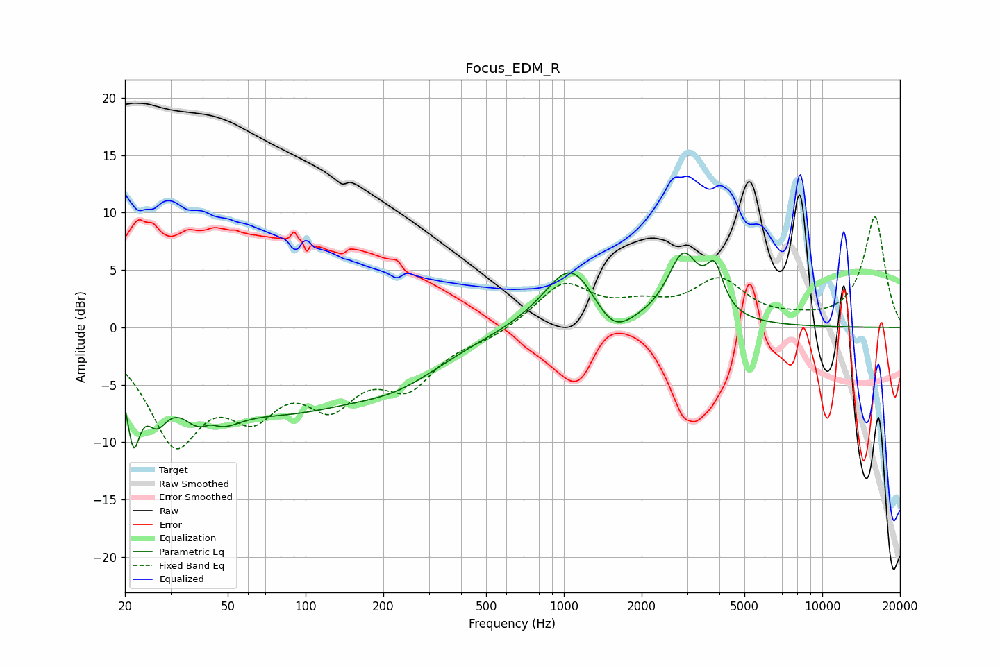

# Focus_EDM_R
See [usage instructions](https://github.com/jaakkopasanen/AutoEq#usage) for more options and info.

### Parametric EQs
Apply preamp of -6.6 dB when using parametric equalizer.

|   # | Type    |   Fc (Hz) |    Q |   Gain (dB) |
|-----|---------|-----------|------|-------------|
|   1 | Peaking |        22 | 5.56 |        -6.4 |
|   2 | Peaking |        26 | 3.14 |        -3.8 |
|   3 | Peaking |        42 | 1.91 |        -8.4 |
|   4 | Peaking |        42 | 2.9  |         4.8 |
|   5 | Peaking |        84 | 0.44 |        -6.2 |
|   6 | Peaking |       233 | 0.76 |        -2.5 |
|   7 | Peaking |      1067 | 1.35 |         5.8 |
|   8 | Peaking |      1547 | 1.9  |        -2.5 |
|   9 | Peaking |      2898 | 2.34 |         5.8 |
|  10 | Peaking |      3836 | 4.3  |         3.6 |

### Fixed Band EQs
When using fixed band (also called graphic) equalizer, apply preamp of **-9.7 dB** (if available) and set gains manually with these parameters.

|   # | Type    |   Fc (Hz) |    Q |   Gain (dB) |
|-----|---------|-----------|------|-------------|
|   1 | Peaking |        31 | 1.41 |        -9.3 |
|   2 | Peaking |        62 | 1.41 |        -5.6 |
|   3 | Peaking |       125 | 1.41 |        -5.3 |
|   4 | Peaking |       250 | 1.41 |        -4.4 |
|   5 | Peaking |       500 | 1.41 |        -0.8 |
|   6 | Peaking |      1000 | 1.41 |         3.8 |
|   7 | Peaking |      2000 | 1.41 |         1.4 |
|   8 | Peaking |      4000 | 1.41 |         3.8 |
|   9 | Peaking |      8000 | 1.41 |         0.4 |
|  10 | Peaking |     16000 | 1.41 |         9.6 |

### Graphs

