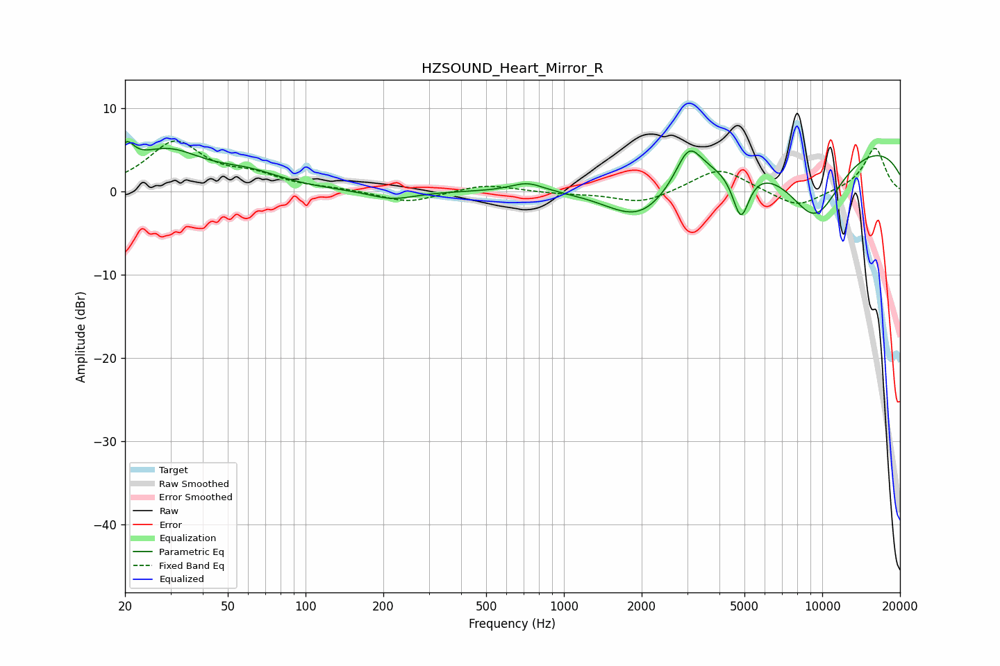

# HZSOUND_Heart_Mirror_R
See [usage instructions](https://github.com/jaakkopasanen/AutoEq#usage) for more options and info.

### Parametric EQs
Apply preamp of -6.1 dB when using parametric equalizer.

|   # | Type    |   Fc (Hz) |    Q |   Gain (dB) |
|-----|---------|-----------|------|-------------|
|   1 | Peaking |        20 | 4.86 |         2.8 |
|   2 | Peaking |        29 | 1    |         4.6 |
|   3 | Peaking |        61 | 1.12 |         1.6 |
|   4 | Peaking |       216 | 1.56 |        -1.1 |
|   5 | Peaking |       722 | 2.27 |         1.1 |
|   6 | Peaking |      1984 | 0.98 |        -5.9 |
|   7 | Peaking |      3042 | 2.84 |         4.3 |
|   8 | Peaking |      4844 | 4.23 |        -6   |
|   9 | Peaking |      9336 | 1.05 |        -9.2 |
|  10 | Peaking |      9426 | 0.18 |         6.8 |

### Fixed Band EQs
When using fixed band (also called graphic) equalizer, apply preamp of **-6.1 dB** (if available) and set gains manually with these parameters.

|   # | Type    |   Fc (Hz) |    Q |   Gain (dB) |
|-----|---------|-----------|------|-------------|
|   1 | Peaking |        31 | 1.41 |         5.8 |
|   2 | Peaking |        62 | 1.41 |         1.5 |
|   3 | Peaking |       125 | 1.41 |         0.2 |
|   4 | Peaking |       250 | 1.41 |        -1.4 |
|   5 | Peaking |       500 | 1.41 |         0.9 |
|   6 | Peaking |      1000 | 1.41 |        -0.2 |
|   7 | Peaking |      2000 | 1.41 |        -1.5 |
|   8 | Peaking |      4000 | 1.41 |         2.9 |
|   9 | Peaking |      8000 | 1.41 |        -2.1 |
|  10 | Peaking |     16000 | 1.41 |         5.3 |

### Graphs

