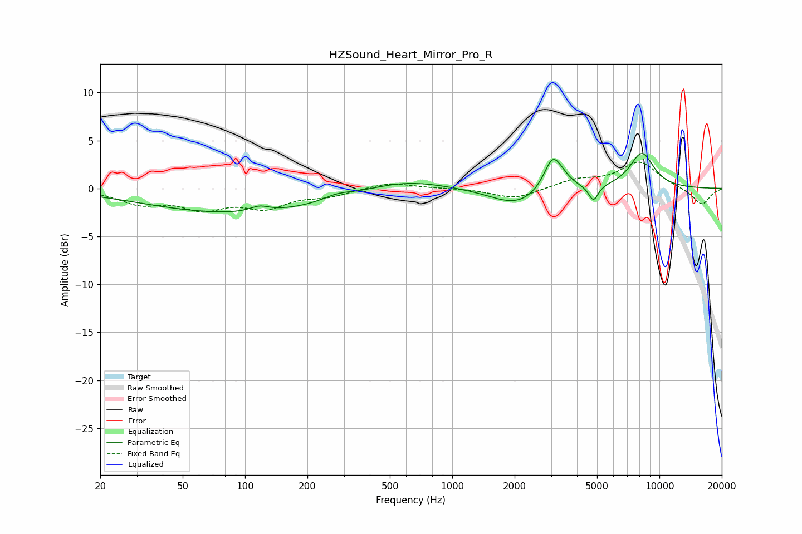

# HZSound_Heart_Mirror_Pro_R
See [usage instructions](https://github.com/jaakkopasanen/AutoEq#usage) for more options and info.

### Parametric EQs
Apply preamp of -3.7 dB when using parametric equalizer.

|   # | Type    |   Fc (Hz) |    Q |   Gain (dB) |
|-----|---------|-----------|------|-------------|
|   1 | Peaking |        95 | 0.31 |        -2.6 |
|   2 | Peaking |       117 | 3.06 |         0.6 |
|   3 | Peaking |       279 | 2.05 |         0.5 |
|   4 | Peaking |       576 | 0.71 |         1.2 |
|   5 | Peaking |      1801 | 0.97 |        -0.4 |
|   6 | Peaking |      2076 | 1.25 |        -1.4 |
|   7 | Peaking |      3046 | 3.31 |         3.3 |
|   8 | Peaking |      3393 | 3.21 |         0.6 |
|   9 | Peaking |      4802 | 6    |        -1.7 |
|  10 | Peaking |      8222 | 2.22 |         3.7 |

### Fixed Band EQs
When using fixed band (also called graphic) equalizer, apply preamp of **-2.8 dB** (if available) and set gains manually with these parameters.

|   # | Type    |   Fc (Hz) |    Q |   Gain (dB) |
|-----|---------|-----------|------|-------------|
|   1 | Peaking |        31 | 1.41 |        -1.4 |
|   2 | Peaking |        62 | 1.41 |        -1.9 |
|   3 | Peaking |       125 | 1.41 |        -1.8 |
|   4 | Peaking |       250 | 1.41 |        -0.7 |
|   5 | Peaking |       500 | 1.41 |         0.7 |
|   6 | Peaking |      1000 | 1.41 |         0   |
|   7 | Peaking |      2000 | 1.41 |        -1.1 |
|   8 | Peaking |      4000 | 1.41 |         0.9 |
|   9 | Peaking |      8000 | 1.41 |         2.7 |
|  10 | Peaking |     16000 | 1.41 |        -1.7 |

### Graphs

