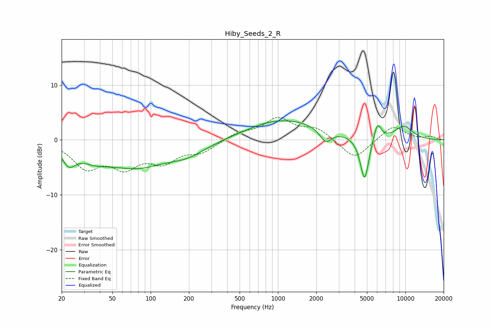

# Hiby_Seeds_2_R
See [usage instructions](https://github.com/jaakkopasanen/AutoEq#usage) for more options and info.

### Parametric EQs
Apply preamp of -3.6 dB when using parametric equalizer.

|   # | Type    |   Fc (Hz) |    Q |   Gain (dB) |
|-----|---------|-----------|------|-------------|
|   1 | Peaking |        23 | 2.78 |        -2.9 |
|   2 | Peaking |        36 | 1.08 |        -2.2 |
|   3 | Peaking |        78 | 0.61 |        -4.4 |
|   4 | Peaking |       196 | 0.94 |        -2   |
|   5 | Peaking |       808 | 1.17 |         0.4 |
|   6 | Peaking |      1212 | 0.48 |         3.5 |
|   7 | Peaking |      2369 | 3.06 |        -2.5 |
|   8 | Peaking |      4786 | 4.03 |        -8.2 |
|   9 | Peaking |      6022 | 4.74 |         3.3 |
|  10 | Peaking |      9750 | 1.73 |         2.4 |

### Fixed Band EQs
When using fixed band (also called graphic) equalizer, apply preamp of **-4.2 dB** (if available) and set gains manually with these parameters.

|   # | Type    |   Fc (Hz) |    Q |   Gain (dB) |
|-----|---------|-----------|------|-------------|
|   1 | Peaking |        31 | 1.41 |        -4.7 |
|   2 | Peaking |        62 | 1.41 |        -4.3 |
|   3 | Peaking |       125 | 1.41 |        -3.5 |
|   4 | Peaking |       250 | 1.41 |        -2   |
|   5 | Peaking |       500 | 1.41 |         1.2 |
|   6 | Peaking |      1000 | 1.41 |         3.7 |
|   7 | Peaking |      2000 | 1.41 |         2   |
|   8 | Peaking |      4000 | 1.41 |        -3.7 |
|   9 | Peaking |      8000 | 1.41 |         2.7 |
|  10 | Peaking |     16000 | 1.41 |         0.6 |

### Graphs

