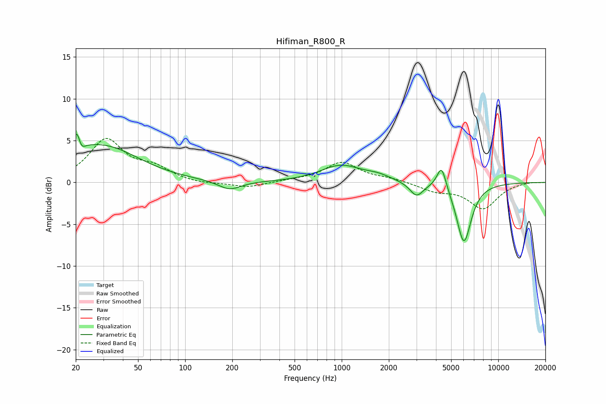

# Hifiman_R800_R
See [usage instructions](https://github.com/jaakkopasanen/AutoEq#usage) for more options and info.

### Parametric EQs
Apply preamp of -5.8 dB when using parametric equalizer.

|   # | Type    |   Fc (Hz) |    Q |   Gain (dB) |
|-----|---------|-----------|------|-------------|
|   1 | Peaking |        20 | 1.72 |         0.9 |
|   2 | Peaking |        20 | 5.88 |         3.1 |
|   3 | Peaking |        21 | 5.89 |        -2   |
|   4 | Peaking |        30 | 0.63 |         4.1 |
|   5 | Peaking |       193 | 1.94 |        -1.1 |
|   6 | Peaking |       989 | 1.09 |         2   |
|   7 | Peaking |      1707 | 1.77 |         0.5 |
|   8 | Peaking |      3005 | 3.29 |        -1.7 |
|   9 | Peaking |      4344 | 4.72 |         2.9 |
|  10 | Peaking |      6032 | 2.91 |        -7.2 |

### Fixed Band EQs
When using fixed band (also called graphic) equalizer, apply preamp of **-5.4 dB** (if available) and set gains manually with these parameters.

|   # | Type    |   Fc (Hz) |    Q |   Gain (dB) |
|-----|---------|-----------|------|-------------|
|   1 | Peaking |        31 | 1.41 |         5   |
|   2 | Peaking |        62 | 1.41 |         1.5 |
|   3 | Peaking |       125 | 1.41 |        -0.2 |
|   4 | Peaking |       250 | 1.41 |        -0.6 |
|   5 | Peaking |       500 | 1.41 |         0.2 |
|   6 | Peaking |      1000 | 1.41 |         2.4 |
|   7 | Peaking |      2000 | 1.41 |         0.4 |
|   8 | Peaking |      4000 | 1.41 |        -0.9 |
|   9 | Peaking |      8000 | 1.41 |        -3.1 |
|  10 | Peaking |     16000 | 1.41 |         0.1 |

### Graphs

