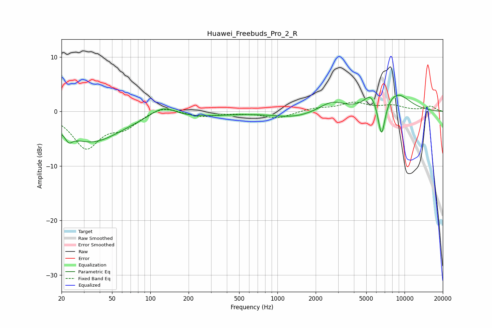

# Huawei_Freebuds_Pro_2_R
See [usage instructions](https://github.com/jaakkopasanen/AutoEq#usage) for more options and info.

### Parametric EQs
Apply preamp of -3.1 dB when using parametric equalizer.

|   # | Type    |   Fc (Hz) |    Q |   Gain (dB) |
|-----|---------|-----------|------|-------------|
|   1 | Peaking |        23 | 5.2  |        -1.4 |
|   2 | Peaking |        34 | 0.62 |        -5.3 |
|   3 | Peaking |        43 | 0.18 |        -0.2 |
|   4 | Peaking |       126 | 1.38 |         2.3 |
|   5 | Peaking |       204 | 0.53 |        -0.8 |
|   6 | Peaking |      1364 | 0.83 |        -1.1 |
|   7 | Peaking |      2680 | 1.43 |         1.9 |
|   8 | Peaking |      5418 | 2.77 |         2.4 |
|   9 | Peaking |      6594 | 4.82 |        -6.9 |
|  10 | Peaking |      8675 | 1.19 |         3.3 |

### Fixed Band EQs
When using fixed band (also called graphic) equalizer, apply preamp of **-1.8 dB** (if available) and set gains manually with these parameters.

|   # | Type    |   Fc (Hz) |    Q |   Gain (dB) |
|-----|---------|-----------|------|-------------|
|   1 | Peaking |        31 | 1.41 |        -6.5 |
|   2 | Peaking |        62 | 1.41 |        -2.5 |
|   3 | Peaking |       125 | 1.41 |         1.2 |
|   4 | Peaking |       250 | 1.41 |        -1   |
|   5 | Peaking |       500 | 1.41 |        -0.2 |
|   6 | Peaking |      1000 | 1.41 |        -1.2 |
|   7 | Peaking |      2000 | 1.41 |         0.6 |
|   8 | Peaking |      4000 | 1.41 |         1.5 |
|   9 | Peaking |      8000 | 1.41 |         1   |
|  10 | Peaking |     16000 | 1.41 |         0.9 |

### Graphs

