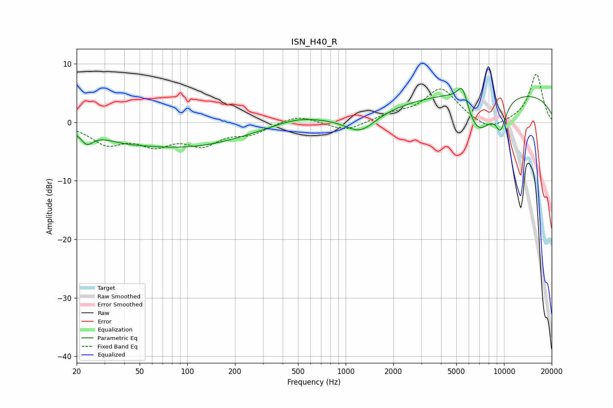

# ISN_H40_R
See [usage instructions](https://github.com/jaakkopasanen/AutoEq#usage) for more options and info.

### Parametric EQs
Apply preamp of -5.9 dB when using parametric equalizer.

|   # | Type    |   Fc (Hz) |    Q |   Gain (dB) |
|-----|---------|-----------|------|-------------|
|   1 | Peaking |        23 | 3.77 |        -2   |
|   2 | Peaking |        39 | 1.12 |        -0.7 |
|   3 | Peaking |        93 | 0.36 |        -4.1 |
|   4 | Peaking |       495 | 0.9  |         1.2 |
|   5 | Peaking |      1238 | 1.49 |        -3.1 |
|   6 | Peaking |      5137 | 1.19 |         1.9 |
|   7 | Peaking |      5466 | 4.24 |         3.6 |
|   8 | Peaking |      6816 | 1.44 |        -7.5 |
|   9 | Peaking |      8743 | 0.18 |         5.5 |
|  10 | Peaking |      9526 | 3.63 |        -4.3 |

### Fixed Band EQs
When using fixed band (also called graphic) equalizer, apply preamp of **-8.3 dB** (if available) and set gains manually with these parameters.

|   # | Type    |   Fc (Hz) |    Q |   Gain (dB) |
|-----|---------|-----------|------|-------------|
|   1 | Peaking |        31 | 1.41 |        -3.4 |
|   2 | Peaking |        62 | 1.41 |        -3.3 |
|   3 | Peaking |       125 | 1.41 |        -3.3 |
|   4 | Peaking |       250 | 1.41 |        -1.7 |
|   5 | Peaking |       500 | 1.41 |         1.4 |
|   6 | Peaking |      1000 | 1.41 |        -1.6 |
|   7 | Peaking |      2000 | 1.41 |         1.2 |
|   8 | Peaking |      4000 | 1.41 |         5.7 |
|   9 | Peaking |      8000 | 1.41 |        -1.7 |
|  10 | Peaking |     16000 | 1.41 |         8.3 |

### Graphs

