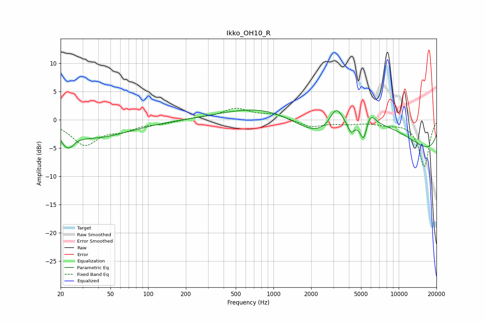

# Ikko_OH10_R
See [usage instructions](https://github.com/jaakkopasanen/AutoEq#usage) for more options and info.

### Parametric EQs
Apply preamp of -1.8 dB when using parametric equalizer.

|   # | Type    |   Fc (Hz) |    Q |   Gain (dB) |
|-----|---------|-----------|------|-------------|
|   1 | Peaking |        23 | 4.03 |        -4.4 |
|   2 | Peaking |        23 | 5.65 |         1.9 |
|   3 | Peaking |        36 | 0.47 |        -3.1 |
|   4 | Peaking |      2227 | 0.5  |        -8.5 |
|   5 | Peaking |      3173 | 2.71 |         3.9 |
|   6 | Peaking |      3482 | 0.21 |        11.4 |
|   7 | Peaking |      4154 | 6    |        -1.7 |
|   8 | Peaking |      5247 | 5.2  |        -3.6 |
|   9 | Peaking |      5892 | 3.27 |         2.3 |
|  10 | Peaking |     10000 | 0.18 |        -8.7 |

### Fixed Band EQs
When using fixed band (also called graphic) equalizer, apply preamp of **-2.1 dB** (if available) and set gains manually with these parameters.

|   # | Type    |   Fc (Hz) |    Q |   Gain (dB) |
|-----|---------|-----------|------|-------------|
|   1 | Peaking |        31 | 1.41 |        -4.3 |
|   2 | Peaking |        62 | 1.41 |        -1.5 |
|   3 | Peaking |       125 | 1.41 |        -0.5 |
|   4 | Peaking |       250 | 1.41 |         0.3 |
|   5 | Peaking |       500 | 1.41 |         1.9 |
|   6 | Peaking |      1000 | 1.41 |         0.9 |
|   7 | Peaking |      2000 | 1.41 |        -1.3 |
|   8 | Peaking |      4000 | 1.41 |        -0.5 |
|   9 | Peaking |      8000 | 1.41 |        -0.6 |
|  10 | Peaking |     16000 | 1.41 |        -8.3 |

### Graphs

