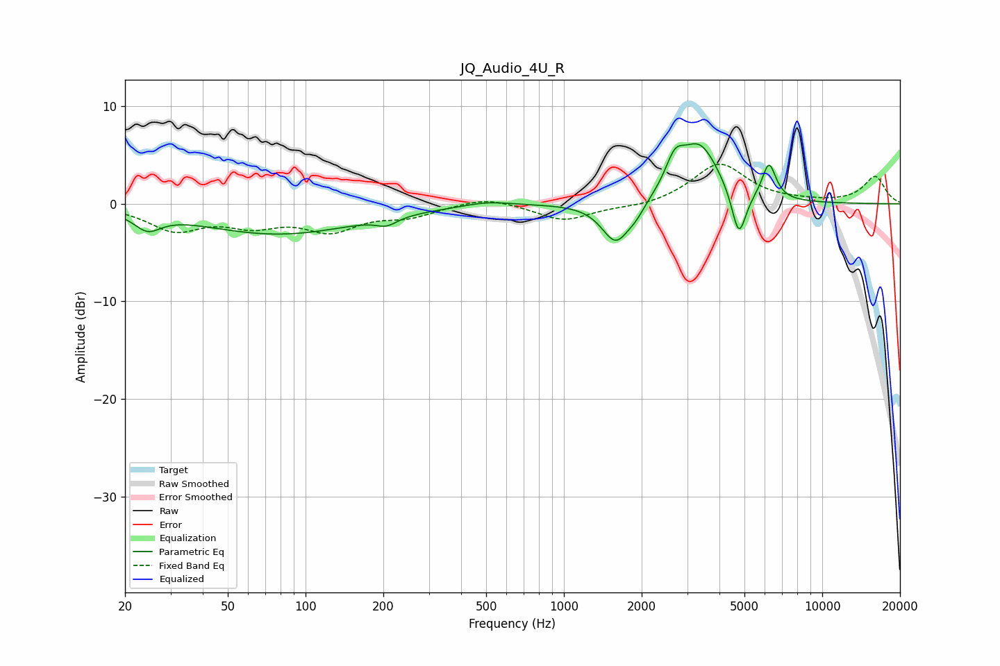

# JQ_Audio_4U_R
See [usage instructions](https://github.com/jaakkopasanen/AutoEq#usage) for more options and info.

### Parametric EQs
Apply preamp of -6.2 dB when using parametric equalizer.

|   # | Type    |   Fc (Hz) |    Q |   Gain (dB) |
|-----|---------|-----------|------|-------------|
|   1 | Peaking |        24 | 2.76 |        -1.7 |
|   2 | Peaking |        79 | 0.45 |        -3.1 |
|   3 | Peaking |       206 | 3.51 |        -0.8 |
|   4 | Peaking |       505 | 1.56 |         0.5 |
|   5 | Peaking |      1589 | 2.59 |        -4.2 |
|   6 | Peaking |      1904 | 4.01 |        -0.9 |
|   7 | Peaking |      2686 | 3.89 |         2.8 |
|   8 | Peaking |      3348 | 1.8  |         5.9 |
|   9 | Peaking |      4757 | 4.99 |        -5   |
|  10 | Peaking |      6221 | 5.17 |         3.7 |

### Fixed Band EQs
When using fixed band (also called graphic) equalizer, apply preamp of **-4.2 dB** (if available) and set gains manually with these parameters.

|   # | Type    |   Fc (Hz) |    Q |   Gain (dB) |
|-----|---------|-----------|------|-------------|
|   1 | Peaking |        31 | 1.41 |        -2.5 |
|   2 | Peaking |        62 | 1.41 |        -1.8 |
|   3 | Peaking |       125 | 1.41 |        -2.5 |
|   4 | Peaking |       250 | 1.41 |        -1.1 |
|   5 | Peaking |       500 | 1.41 |         0.8 |
|   6 | Peaking |      1000 | 1.41 |        -1.7 |
|   7 | Peaking |      2000 | 1.41 |        -0.4 |
|   8 | Peaking |      4000 | 1.41 |         4.1 |
|   9 | Peaking |      8000 | 1.41 |         0.1 |
|  10 | Peaking |     16000 | 1.41 |         2.8 |

### Graphs

