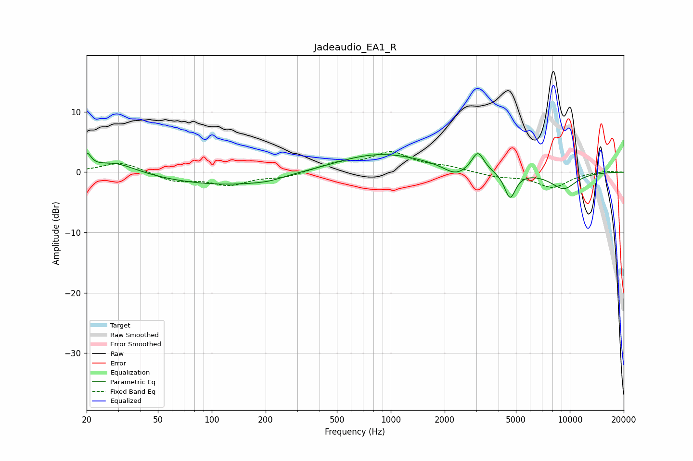

# Jadeaudio_EA1_R
See [usage instructions](https://github.com/jaakkopasanen/AutoEq#usage) for more options and info.

### Parametric EQs
Apply preamp of -3.3 dB when using parametric equalizer.

|   # | Type    |   Fc (Hz) |    Q |   Gain (dB) |
|-----|---------|-----------|------|-------------|
|   1 | Peaking |        20 | 5.98 |         2.4 |
|   2 | Peaking |        29 | 1.19 |         1.9 |
|   3 | Peaking |       139 | 0.36 |        -2.4 |
|   4 | Peaking |       209 | 1.8  |        -0.4 |
|   5 | Peaking |       270 | 0.95 |         0.5 |
|   6 | Peaking |       847 | 0.53 |         3.3 |
|   7 | Peaking |      2298 | 2.26 |        -1.5 |
|   8 | Peaking |      3066 | 4.19 |         3.2 |
|   9 | Peaking |      4638 | 4.53 |        -4.4 |
|  10 | Peaking |      9220 | 1.71 |        -2.7 |

### Fixed Band EQs
When using fixed band (also called graphic) equalizer, apply preamp of **-3.5 dB** (if available) and set gains manually with these parameters.

|   # | Type    |   Fc (Hz) |    Q |   Gain (dB) |
|-----|---------|-----------|------|-------------|
|   1 | Peaking |        31 | 1.41 |         1.7 |
|   2 | Peaking |        62 | 1.41 |        -1.5 |
|   3 | Peaking |       125 | 1.41 |        -1.9 |
|   4 | Peaking |       250 | 1.41 |        -0.8 |
|   5 | Peaking |       500 | 1.41 |         1.3 |
|   6 | Peaking |      1000 | 1.41 |         3.1 |
|   7 | Peaking |      2000 | 1.41 |         0.8 |
|   8 | Peaking |      4000 | 1.41 |        -0.7 |
|   9 | Peaking |      8000 | 1.41 |        -2.5 |
|  10 | Peaking |     16000 | 1.41 |         0.3 |

### Graphs

