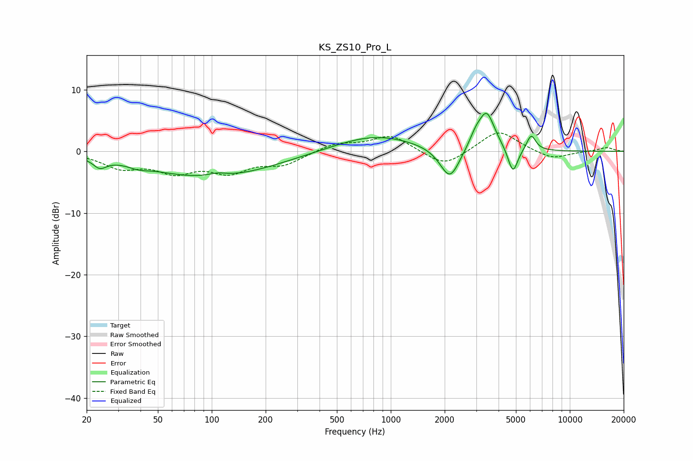

# KS_ZS10_Pro_L
See [usage instructions](https://github.com/jaakkopasanen/AutoEq#usage) for more options and info.

### Parametric EQs
Apply preamp of -6.2 dB when using parametric equalizer.

|   # | Type    |   Fc (Hz) |    Q |   Gain (dB) |
|-----|---------|-----------|------|-------------|
|   1 | Peaking |        24 | 3.85 |        -1.5 |
|   2 | Peaking |        39 | 2.7  |        -0.5 |
|   3 | Peaking |        98 | 0.4  |        -4.3 |
|   4 | Peaking |       107 | 2.53 |         0.6 |
|   5 | Peaking |       815 | 0.62 |         2.7 |
|   6 | Peaking |      2137 | 2.57 |        -5.3 |
|   7 | Peaking |      2973 | 3.94 |         1.7 |
|   8 | Peaking |      3436 | 3.1  |         6   |
|   9 | Peaking |      4811 | 5.11 |        -4.3 |
|  10 | Peaking |      6086 | 5.42 |         2.6 |

### Fixed Band EQs
When using fixed band (also called graphic) equalizer, apply preamp of **-3.1 dB** (if available) and set gains manually with these parameters.

|   # | Type    |   Fc (Hz) |    Q |   Gain (dB) |
|-----|---------|-----------|------|-------------|
|   1 | Peaking |        31 | 1.41 |        -2.4 |
|   2 | Peaking |        62 | 1.41 |        -2.9 |
|   3 | Peaking |       125 | 1.41 |        -3   |
|   4 | Peaking |       250 | 1.41 |        -2   |
|   5 | Peaking |       500 | 1.41 |         1.3 |
|   6 | Peaking |      1000 | 1.41 |         2.6 |
|   7 | Peaking |      2000 | 1.41 |        -2.6 |
|   8 | Peaking |      4000 | 1.41 |         3.5 |
|   9 | Peaking |      8000 | 1.41 |        -1.4 |
|  10 | Peaking |     16000 | 1.41 |         0.6 |

### Graphs

