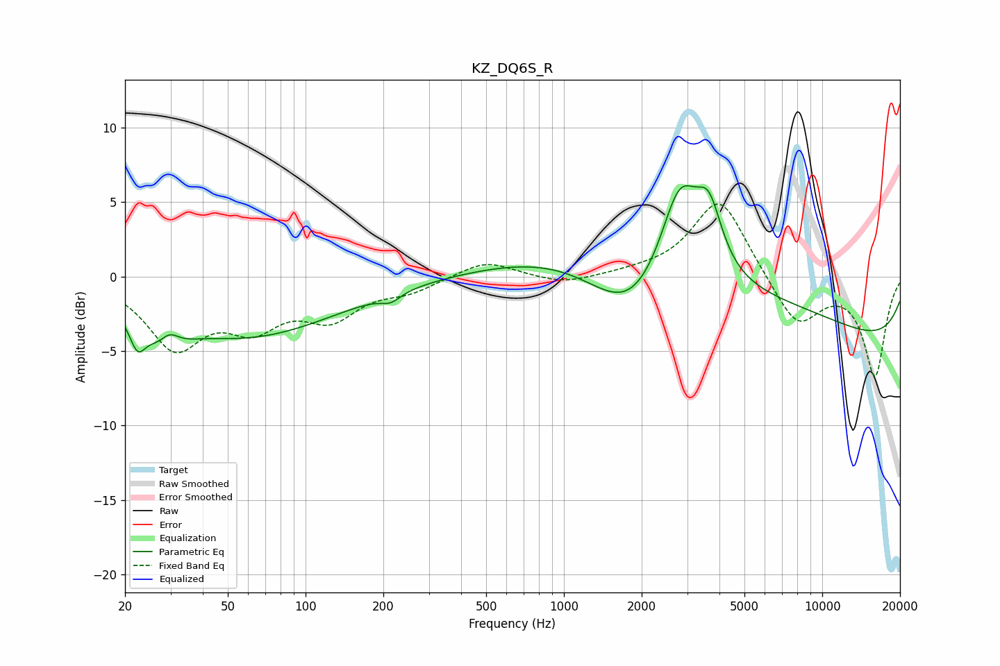

# KZ_DQ6S_R
See [usage instructions](https://github.com/jaakkopasanen/AutoEq#usage) for more options and info.

### Parametric EQs
Apply preamp of -6.2 dB when using parametric equalizer.

|   # | Type    |   Fc (Hz) |    Q |   Gain (dB) |
|-----|---------|-----------|------|-------------|
|   1 | Peaking |        22 | 4.69 |        -2   |
|   2 | Peaking |        29 | 2.17 |        -3.1 |
|   3 | Peaking |        30 | 3.29 |         2.2 |
|   4 | Peaking |        59 | 0.4  |        -4   |
|   5 | Peaking |       214 | 3.68 |        -0.6 |
|   6 | Peaking |      1825 | 0.87 |        -4.2 |
|   7 | Peaking |      2806 | 1.79 |         6.8 |
|   8 | Peaking |      3101 | 0.21 |         3.7 |
|   9 | Peaking |      3647 | 2.81 |         3.9 |
|  10 | Peaking |     10000 | 0.18 |        -5   |

### Fixed Band EQs
When using fixed band (also called graphic) equalizer, apply preamp of **-5.0 dB** (if available) and set gains manually with these parameters.

|   # | Type    |   Fc (Hz) |    Q |   Gain (dB) |
|-----|---------|-----------|------|-------------|
|   1 | Peaking |        31 | 1.41 |        -4.5 |
|   2 | Peaking |        62 | 1.41 |        -2.8 |
|   3 | Peaking |       125 | 1.41 |        -2.5 |
|   4 | Peaking |       250 | 1.41 |        -0.8 |
|   5 | Peaking |       500 | 1.41 |         1.1 |
|   6 | Peaking |      1000 | 1.41 |        -0.6 |
|   7 | Peaking |      2000 | 1.41 |         0.2 |
|   8 | Peaking |      4000 | 1.41 |         5.4 |
|   9 | Peaking |      8000 | 1.41 |        -3.4 |
|  10 | Peaking |     16000 | 1.41 |        -6.6 |

### Graphs

