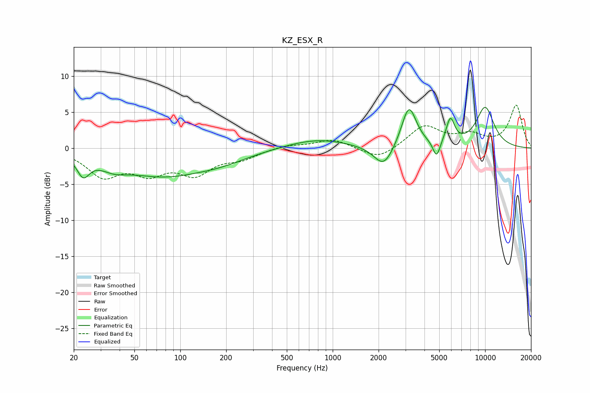

# KZ_ESX_R
See [usage instructions](https://github.com/jaakkopasanen/AutoEq#usage) for more options and info.

### Parametric EQs
Apply preamp of -5.8 dB when using parametric equalizer.

|   # | Type    |   Fc (Hz) |    Q |   Gain (dB) |
|-----|---------|-----------|------|-------------|
|   1 | Peaking |        23 | 3.51 |        -2.7 |
|   2 | Peaking |        37 | 1.54 |        -1.3 |
|   3 | Peaking |        75 | 0.54 |        -3.4 |
|   4 | Peaking |       184 | 0.73 |        -1.3 |
|   5 | Peaking |       789 | 0.7  |         1.3 |
|   6 | Peaking |      2164 | 2.19 |        -3.1 |
|   7 | Peaking |      3163 | 2.87 |         5.9 |
|   8 | Peaking |      4804 | 5.79 |        -2.4 |
|   9 | Peaking |      5916 | 4.93 |         3.5 |
|  10 | Peaking |     10000 | 2    |         5.6 |

### Fixed Band EQs
When using fixed band (also called graphic) equalizer, apply preamp of **-6.1 dB** (if available) and set gains manually with these parameters.

|   # | Type    |   Fc (Hz) |    Q |   Gain (dB) |
|-----|---------|-----------|------|-------------|
|   1 | Peaking |        31 | 1.41 |        -3.6 |
|   2 | Peaking |        62 | 1.41 |        -2.9 |
|   3 | Peaking |       125 | 1.41 |        -3.2 |
|   4 | Peaking |       250 | 1.41 |        -1.2 |
|   5 | Peaking |       500 | 1.41 |         0.5 |
|   6 | Peaking |      1000 | 1.41 |         1.2 |
|   7 | Peaking |      2000 | 1.41 |        -1.7 |
|   8 | Peaking |      4000 | 1.41 |         3   |
|   9 | Peaking |      8000 | 1.41 |         1.6 |
|  10 | Peaking |     16000 | 1.41 |         5.9 |

### Graphs

