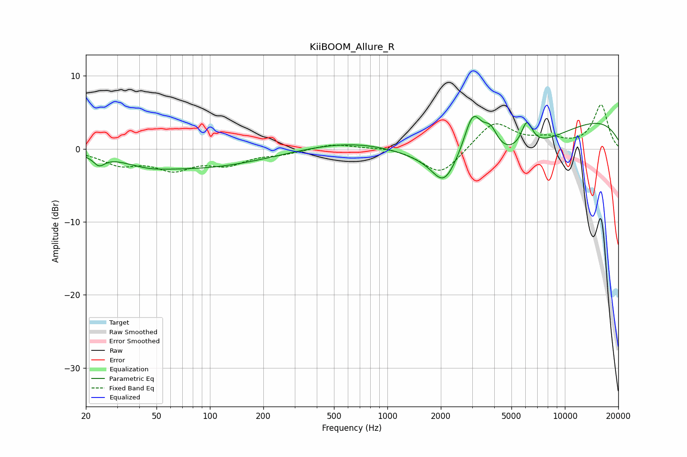

# KiiBOOM_Allure_R
See [usage instructions](https://github.com/jaakkopasanen/AutoEq#usage) for more options and info.

### Parametric EQs
Apply preamp of -4.5 dB when using parametric equalizer.

|   # | Type    |   Fc (Hz) |    Q |   Gain (dB) |
|-----|---------|-----------|------|-------------|
|   1 | Peaking |        24 | 4.53 |        -1.3 |
|   2 | Peaking |        45 | 1.17 |        -0.8 |
|   3 | Peaking |       138 | 0.32 |        -4   |
|   4 | Peaking |       601 | 0.18 |         3.3 |
|   5 | Peaking |      2075 | 2.19 |        -3.5 |
|   6 | Peaking |      3033 | 2.62 |         6.7 |
|   7 | Peaking |      3442 | 0.36 |        -7.2 |
|   8 | Peaking |      3808 | 3.41 |         3   |
|   9 | Peaking |      6108 | 4.22 |         3.6 |
|  10 | Peaking |      9867 | 0.22 |         5.1 |

### Fixed Band EQs
When using fixed band (also called graphic) equalizer, apply preamp of **-6.1 dB** (if available) and set gains manually with these parameters.

|   # | Type    |   Fc (Hz) |    Q |   Gain (dB) |
|-----|---------|-----------|------|-------------|
|   1 | Peaking |        31 | 1.41 |        -1.9 |
|   2 | Peaking |        62 | 1.41 |        -2.5 |
|   3 | Peaking |       125 | 1.41 |        -1.9 |
|   4 | Peaking |       250 | 1.41 |        -0.6 |
|   5 | Peaking |       500 | 1.41 |         0.7 |
|   6 | Peaking |      1000 | 1.41 |         0.3 |
|   7 | Peaking |      2000 | 1.41 |        -3.7 |
|   8 | Peaking |      4000 | 1.41 |         3.8 |
|   9 | Peaking |      8000 | 1.41 |         1.1 |
|  10 | Peaking |     16000 | 1.41 |         6   |

### Graphs

