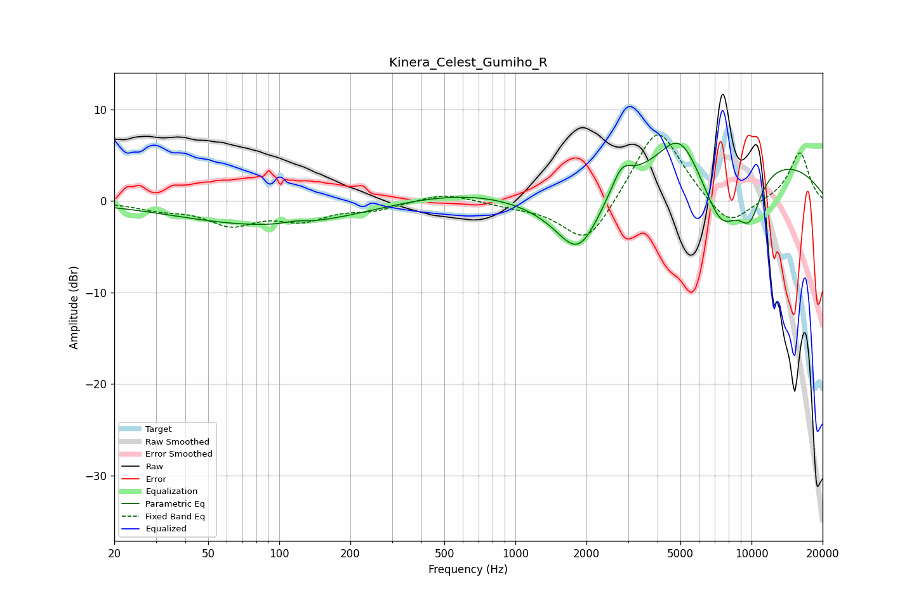

# Kinera_Celest_Gumiho_R
See [usage instructions](https://github.com/jaakkopasanen/AutoEq#usage) for more options and info.

### Parametric EQs
Apply preamp of -6.4 dB when using parametric equalizer.

|   # | Type    |   Fc (Hz) |    Q |   Gain (dB) |
|-----|---------|-----------|------|-------------|
|   1 | Peaking |        97 | 0.35 |        -2.8 |
|   2 | Peaking |       116 | 3.39 |         0.3 |
|   3 | Peaking |       702 | 0.36 |         1.5 |
|   4 | Peaking |      1507 | 0.66 |        -2.6 |
|   5 | Peaking |      1857 | 1.49 |        -6.6 |
|   6 | Peaking |      2816 | 3.45 |         2.4 |
|   7 | Peaking |      4972 | 1.74 |         4.2 |
|   8 | Peaking |      7289 | 0.2  |         5.4 |
|   9 | Peaking |      7440 | 1.55 |        -7.1 |
|  10 | Peaking |      9830 | 2.42 |        -4.7 |

### Fixed Band EQs
When using fixed band (also called graphic) equalizer, apply preamp of **-7.3 dB** (if available) and set gains manually with these parameters.

|   # | Type    |   Fc (Hz) |    Q |   Gain (dB) |
|-----|---------|-----------|------|-------------|
|   1 | Peaking |        31 | 1.41 |        -0.8 |
|   2 | Peaking |        62 | 1.41 |        -2.4 |
|   3 | Peaking |       125 | 1.41 |        -1.8 |
|   4 | Peaking |       250 | 1.41 |        -0.9 |
|   5 | Peaking |       500 | 1.41 |         0.9 |
|   6 | Peaking |      1000 | 1.41 |        -0.4 |
|   7 | Peaking |      2000 | 1.41 |        -5.1 |
|   8 | Peaking |      4000 | 1.41 |         8.5 |
|   9 | Peaking |      8000 | 1.41 |        -3.3 |
|  10 | Peaking |     16000 | 1.41 |         5.4 |

### Graphs

