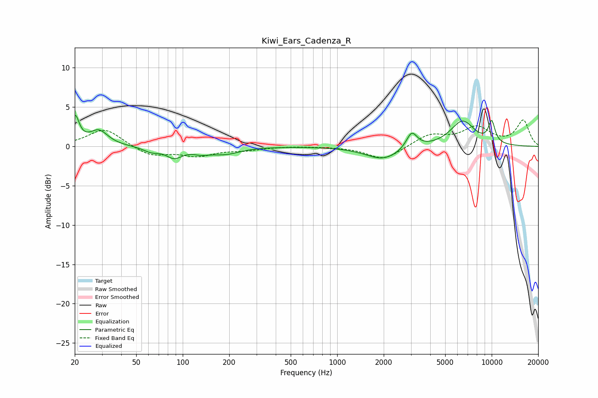

# Kiwi_Ears_Cadenza_R
See [usage instructions](https://github.com/jaakkopasanen/AutoEq#usage) for more options and info.

### Parametric EQs
Apply preamp of -4.0 dB when using parametric equalizer.

|   # | Type    |   Fc (Hz) |    Q |   Gain (dB) |
|-----|---------|-----------|------|-------------|
|   1 | Peaking |        20 | 5.5  |         3.5 |
|   2 | Peaking |        29 | 2.39 |         1.9 |
|   3 | Peaking |        62 | 2.79 |        -0.6 |
|   4 | Peaking |        88 | 2.75 |        -1.3 |
|   5 | Peaking |       133 | 2.5  |        -0.6 |
|   6 | Peaking |       189 | 1.53 |        -0.9 |
|   7 | Peaking |      1981 | 1.26 |        -1.7 |
|   8 | Peaking |      3037 | 4.08 |         2.1 |
|   9 | Peaking |      6477 | 1.74 |         3.2 |
|  10 | Peaking |     10000 | 5.55 |         2.7 |

### Fixed Band EQs
When using fixed band (also called graphic) equalizer, apply preamp of **-3.5 dB** (if available) and set gains manually with these parameters.

|   # | Type    |   Fc (Hz) |    Q |   Gain (dB) |
|-----|---------|-----------|------|-------------|
|   1 | Peaking |        31 | 1.41 |         2.3 |
|   2 | Peaking |        62 | 1.41 |        -1.2 |
|   3 | Peaking |       125 | 1.41 |        -1.1 |
|   4 | Peaking |       250 | 1.41 |        -0.4 |
|   5 | Peaking |       500 | 1.41 |         0.1 |
|   6 | Peaking |      1000 | 1.41 |        -0   |
|   7 | Peaking |      2000 | 1.41 |        -1.7 |
|   8 | Peaking |      4000 | 1.41 |         1.4 |
|   9 | Peaking |      8000 | 1.41 |         2.3 |
|  10 | Peaking |     16000 | 1.41 |         3.2 |

### Graphs

