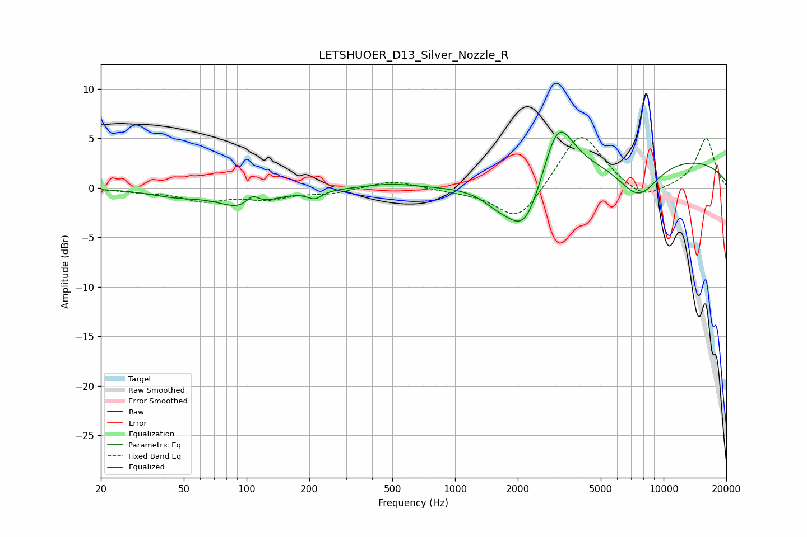

# LETSHUOER_D13_Silver_Nozzle_R
See [usage instructions](https://github.com/jaakkopasanen/AutoEq#usage) for more options and info.

### Parametric EQs
Apply preamp of -5.7 dB when using parametric equalizer.

|   # | Type    |   Fc (Hz) |    Q |   Gain (dB) |
|-----|---------|-----------|------|-------------|
|   1 | Peaking |        45 | 1.1  |        -0.7 |
|   2 | Peaking |        98 | 1.23 |        -2   |
|   3 | Peaking |       107 | 4.35 |         1.2 |
|   4 | Peaking |       212 | 4.02 |        -0.8 |
|   5 | Peaking |       490 | 1.27 |         0.4 |
|   6 | Peaking |      1585 | 1.9  |        -1   |
|   7 | Peaking |      2166 | 1.55 |        -6.1 |
|   8 | Peaking |      3105 | 1.9  |         6.3 |
|   9 | Peaking |      7565 | 1.35 |        -3.8 |
|  10 | Peaking |      9150 | 0.22 |         3.2 |

### Fixed Band EQs
When using fixed band (also called graphic) equalizer, apply preamp of **-5.2 dB** (if available) and set gains manually with these parameters.

|   # | Type    |   Fc (Hz) |    Q |   Gain (dB) |
|-----|---------|-----------|------|-------------|
|   1 | Peaking |        31 | 1.41 |        -0.3 |
|   2 | Peaking |        62 | 1.41 |        -1.2 |
|   3 | Peaking |       125 | 1.41 |        -1   |
|   4 | Peaking |       250 | 1.41 |        -0.5 |
|   5 | Peaking |       500 | 1.41 |         0.8 |
|   6 | Peaking |      1000 | 1.41 |        -0.3 |
|   7 | Peaking |      2000 | 1.41 |        -3.6 |
|   8 | Peaking |      4000 | 1.41 |         5.8 |
|   9 | Peaking |      8000 | 1.41 |        -1.5 |
|  10 | Peaking |     16000 | 1.41 |         5   |

### Graphs

