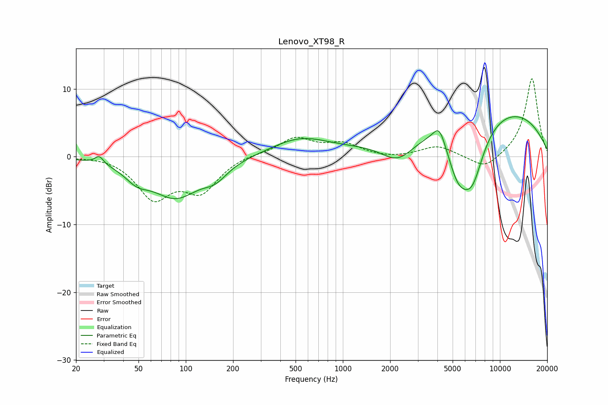

# Lenovo_XT98_R
See [usage instructions](https://github.com/jaakkopasanen/AutoEq#usage) for more options and info.

### Parametric EQs
Apply preamp of -6.0 dB when using parametric equalizer.

|   # | Type    |   Fc (Hz) |    Q |   Gain (dB) |
|-----|---------|-----------|------|-------------|
|   1 | Peaking |        28 | 5.56 |         1.2 |
|   2 | Peaking |        49 | 1.86 |        -1.9 |
|   3 | Peaking |        86 | 0.91 |        -5.7 |
|   4 | Peaking |       154 | 1.83 |        -1.9 |
|   5 | Peaking |       535 | 0.76 |         2.6 |
|   6 | Peaking |      2254 | 1.25 |        -3.8 |
|   7 | Peaking |      4117 | 3.45 |         2.9 |
|   8 | Peaking |      5394 | 1.89 |        -6   |
|   9 | Peaking |      6646 | 1.64 |        -8.6 |
|  10 | Peaking |      8167 | 0.25 |         7.8 |

### Fixed Band EQs
When using fixed band (also called graphic) equalizer, apply preamp of **-11.6 dB** (if available) and set gains manually with these parameters.

|   # | Type    |   Fc (Hz) |    Q |   Gain (dB) |
|-----|---------|-----------|------|-------------|
|   1 | Peaking |        31 | 1.41 |         0.3 |
|   2 | Peaking |        62 | 1.41 |        -5.8 |
|   3 | Peaking |       125 | 1.41 |        -4.7 |
|   4 | Peaking |       250 | 1.41 |         0.4 |
|   5 | Peaking |       500 | 1.41 |         2.7 |
|   6 | Peaking |      1000 | 1.41 |         1.7 |
|   7 | Peaking |      2000 | 1.41 |        -0.3 |
|   8 | Peaking |      4000 | 1.41 |         1.6 |
|   9 | Peaking |      8000 | 1.41 |        -2   |
|  10 | Peaking |     16000 | 1.41 |        11.7 |

### Graphs

