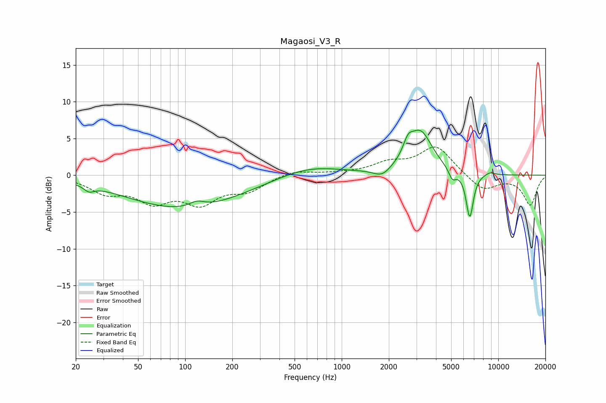

# Magaosi_V3_R
See [usage instructions](https://github.com/jaakkopasanen/AutoEq#usage) for more options and info.

### Parametric EQs
Apply preamp of -6.2 dB when using parametric equalizer.

|   # | Type    |   Fc (Hz) |    Q |   Gain (dB) |
|-----|---------|-----------|------|-------------|
|   1 | Peaking |        24 | 4.38 |        -0.8 |
|   2 | Peaking |        98 | 0.38 |        -4.5 |
|   3 | Peaking |       119 | 2.91 |         0.8 |
|   4 | Peaking |       618 | 0.7  |         1.4 |
|   5 | Peaking |      1813 | 2.61 |        -1.1 |
|   6 | Peaking |      2649 | 4.67 |         1.8 |
|   7 | Peaking |      3177 | 1.8  |         5.7 |
|   8 | Peaking |      5094 | 6    |        -1.4 |
|   9 | Peaking |      6573 | 5.84 |        -6.1 |
|  10 | Peaking |      8849 | 4.14 |         0.4 |

### Fixed Band EQs
When using fixed band (also called graphic) equalizer, apply preamp of **-3.9 dB** (if available) and set gains manually with these parameters.

|   # | Type    |   Fc (Hz) |    Q |   Gain (dB) |
|-----|---------|-----------|------|-------------|
|   1 | Peaking |        31 | 1.41 |        -2.1 |
|   2 | Peaking |        62 | 1.41 |        -3.1 |
|   3 | Peaking |       125 | 1.41 |        -3.4 |
|   4 | Peaking |       250 | 1.41 |        -1.9 |
|   5 | Peaking |       500 | 1.41 |         0.7 |
|   6 | Peaking |      1000 | 1.41 |         0.2 |
|   7 | Peaking |      2000 | 1.41 |         1.5 |
|   8 | Peaking |      4000 | 1.41 |         3.9 |
|   9 | Peaking |      8000 | 1.41 |        -2.1 |
|  10 | Peaking |     16000 | 1.41 |        -4   |

### Graphs

