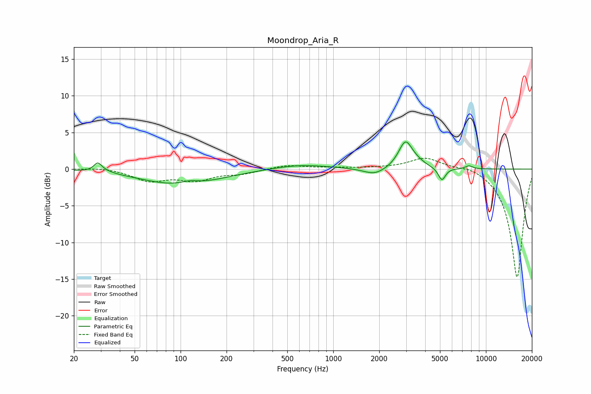

# Moondrop_Aria_R
See [usage instructions](https://github.com/jaakkopasanen/AutoEq#usage) for more options and info.

### Parametric EQs
Apply preamp of -3.8 dB when using parametric equalizer.

|   # | Type    |   Fc (Hz) |    Q |   Gain (dB) |
|-----|---------|-----------|------|-------------|
|   1 | Peaking |        29 | 5.81 |         1.1 |
|   2 | Peaking |        31 | 2.77 |         0.3 |
|   3 | Peaking |       101 | 0.56 |        -2.2 |
|   4 | Peaking |       115 | 2.31 |         0.5 |
|   5 | Peaking |       605 | 0.74 |         0.7 |
|   6 | Peaking |      1870 | 1.95 |        -1   |
|   7 | Peaking |      2972 | 3.08 |         3.7 |
|   8 | Peaking |      3582 | 2.88 |         0.4 |
|   9 | Peaking |      5147 | 5.98 |        -1.7 |
|  10 | Peaking |      7742 | 5.63 |         0.4 |

### Fixed Band EQs
When using fixed band (also called graphic) equalizer, apply preamp of **-1.6 dB** (if available) and set gains manually with these parameters.

|   # | Type    |   Fc (Hz) |    Q |   Gain (dB) |
|-----|---------|-----------|------|-------------|
|   1 | Peaking |        31 | 1.41 |         0.3 |
|   2 | Peaking |        62 | 1.41 |        -1.5 |
|   3 | Peaking |       125 | 1.41 |        -1.4 |
|   4 | Peaking |       250 | 1.41 |        -0.6 |
|   5 | Peaking |       500 | 1.41 |         0.6 |
|   6 | Peaking |      1000 | 1.41 |         0.2 |
|   7 | Peaking |      2000 | 1.41 |         0.1 |
|   8 | Peaking |      4000 | 1.41 |         1.6 |
|   9 | Peaking |      8000 | 1.41 |         0.6 |
|  10 | Peaking |     16000 | 1.41 |       -14.9 |

### Graphs

