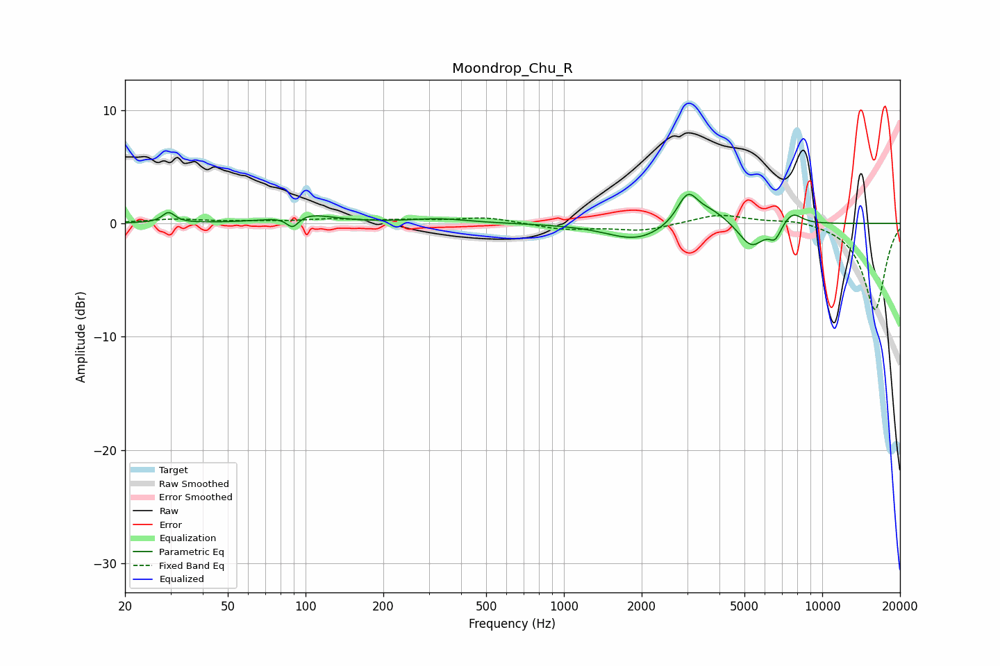

# Moondrop_Chu_R
See [usage instructions](https://github.com/jaakkopasanen/AutoEq#usage) for more options and info.

### Parametric EQs
Apply preamp of -2.7 dB when using parametric equalizer.

|   # | Type    |   Fc (Hz) |    Q |   Gain (dB) |
|-----|---------|-----------|------|-------------|
|   1 | Peaking |        29 | 6    |         0.9 |
|   2 | Peaking |        89 | 6    |        -1.1 |
|   3 | Peaking |       100 | 1.4  |         0.8 |
|   4 | Peaking |       329 | 1.28 |         0.4 |
|   5 | Peaking |      1911 | 1.24 |        -1.5 |
|   6 | Peaking |      3011 | 3.51 |         2.6 |
|   7 | Peaking |      3718 | 1.92 |         1.2 |
|   8 | Peaking |      5315 | 2.78 |        -2.2 |
|   9 | Peaking |      6572 | 5.99 |        -1.2 |
|  10 | Peaking |      7667 | 3.54 |         1.1 |

### Fixed Band EQs
When using fixed band (also called graphic) equalizer, apply preamp of **-0.8 dB** (if available) and set gains manually with these parameters.

|   # | Type    |   Fc (Hz) |    Q |   Gain (dB) |
|-----|---------|-----------|------|-------------|
|   1 | Peaking |        31 | 1.41 |         0.3 |
|   2 | Peaking |        62 | 1.41 |         0.1 |
|   3 | Peaking |       125 | 1.41 |         0.3 |
|   4 | Peaking |       250 | 1.41 |         0.2 |
|   5 | Peaking |       500 | 1.41 |         0.5 |
|   6 | Peaking |      1000 | 1.41 |        -0.5 |
|   7 | Peaking |      2000 | 1.41 |        -0.6 |
|   8 | Peaking |      4000 | 1.41 |         0.8 |
|   9 | Peaking |      8000 | 1.41 |         0.4 |
|  10 | Peaking |     16000 | 1.41 |        -7.7 |

### Graphs

