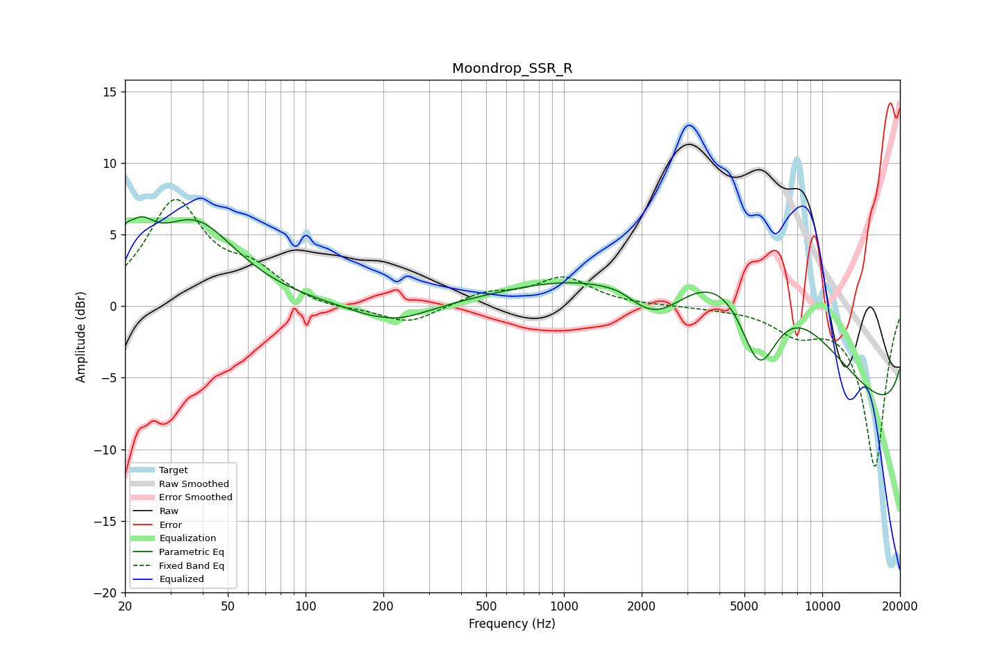

# Moondrop_SSR_R
See [usage instructions](https://github.com/jaakkopasanen/AutoEq#usage) for more options and info.

### Parametric EQs
Apply preamp of -6.3 dB when using parametric equalizer.

|   # | Type    |   Fc (Hz) |    Q |   Gain (dB) |
|-----|---------|-----------|------|-------------|
|   1 | Peaking |        20 | 5.89 |         1.4 |
|   2 | Peaking |        23 | 2.55 |         2.7 |
|   3 | Peaking |        37 | 0.88 |         5.7 |
|   4 | Peaking |       199 | 3.85 |         0.1 |
|   5 | Peaking |       214 | 1.02 |        -1.4 |
|   6 | Peaking |      1653 | 2.08 |         0.4 |
|   7 | Peaking |      2241 | 1.05 |        -3.8 |
|   8 | Peaking |      5673 | 0.27 |        17.8 |
|   9 | Peaking |      5690 | 1.71 |        -7   |
|  10 | Peaking |     10000 | 0.18 |       -15.6 |

### Fixed Band EQs
When using fixed band (also called graphic) equalizer, apply preamp of **-7.6 dB** (if available) and set gains manually with these parameters.

|   # | Type    |   Fc (Hz) |    Q |   Gain (dB) |
|-----|---------|-----------|------|-------------|
|   1 | Peaking |        31 | 1.41 |         7.1 |
|   2 | Peaking |        62 | 1.41 |         2   |
|   3 | Peaking |       125 | 1.41 |        -0.3 |
|   4 | Peaking |       250 | 1.41 |        -1.3 |
|   5 | Peaking |       500 | 1.41 |         0.9 |
|   6 | Peaking |      1000 | 1.41 |         1.9 |
|   7 | Peaking |      2000 | 1.41 |         0   |
|   8 | Peaking |      4000 | 1.41 |        -0.1 |
|   9 | Peaking |      8000 | 1.41 |        -1.7 |
|  10 | Peaking |     16000 | 1.41 |       -11.2 |

### Graphs

