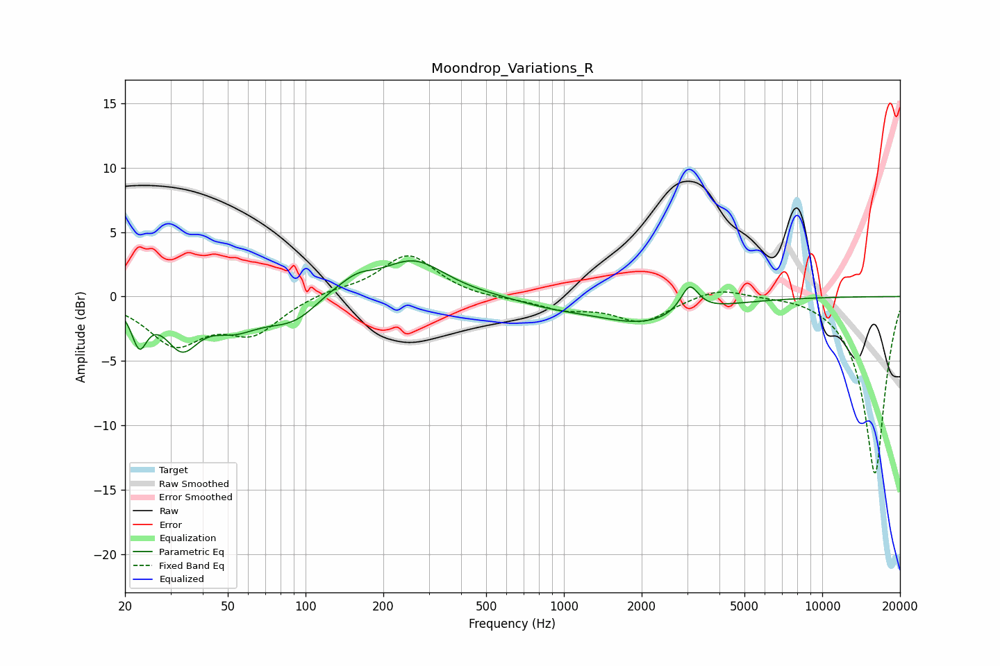

# Moondrop_Variations_R
See [usage instructions](https://github.com/jaakkopasanen/AutoEq#usage) for more options and info.

### Parametric EQs
Apply preamp of -2.9 dB when using parametric equalizer.

|   # | Type    |   Fc (Hz) |    Q |   Gain (dB) |
|-----|---------|-----------|------|-------------|
|   1 | Peaking |        23 | 4.92 |        -3   |
|   2 | Peaking |        33 | 2.24 |        -3.4 |
|   3 | Peaking |        53 | 1.51 |        -1.8 |
|   4 | Peaking |        94 | 1.13 |        -2.5 |
|   5 | Peaking |       121 | 1.3  |         1.3 |
|   6 | Peaking |       160 | 2.25 |         0.9 |
|   7 | Peaking |       261 | 1.13 |         2.8 |
|   8 | Peaking |       897 | 1.04 |        -0.5 |
|   9 | Peaking |      2029 | 0.73 |        -2   |
|  10 | Peaking |      3066 | 4.07 |         2.2 |

### Fixed Band EQs
When using fixed band (also called graphic) equalizer, apply preamp of **-3.3 dB** (if available) and set gains manually with these parameters.

|   # | Type    |   Fc (Hz) |    Q |   Gain (dB) |
|-----|---------|-----------|------|-------------|
|   1 | Peaking |        31 | 1.41 |        -3.5 |
|   2 | Peaking |        62 | 1.41 |        -2.6 |
|   3 | Peaking |       125 | 1.41 |         0.4 |
|   4 | Peaking |       250 | 1.41 |         3.3 |
|   5 | Peaking |       500 | 1.41 |        -0.2 |
|   6 | Peaking |      1000 | 1.41 |        -0.9 |
|   7 | Peaking |      2000 | 1.41 |        -1.9 |
|   8 | Peaking |      4000 | 1.41 |         0.8 |
|   9 | Peaking |      8000 | 1.41 |         0.2 |
|  10 | Peaking |     16000 | 1.41 |       -13.8 |

### Graphs

