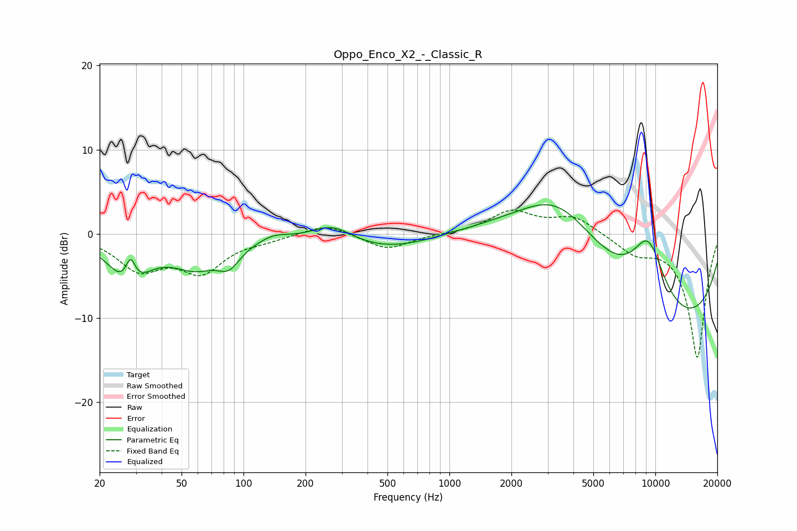

# Oppo_Enco_X2_-_Classic_R
See [usage instructions](https://github.com/jaakkopasanen/AutoEq#usage) for more options and info.

### Parametric EQs
Apply preamp of -3.6 dB when using parametric equalizer.

|   # | Type    |   Fc (Hz) |    Q |   Gain (dB) |
|-----|---------|-----------|------|-------------|
|   1 | Peaking |        28 | 1.61 |        -5.6 |
|   2 | Peaking |        28 | 5.68 |         3.4 |
|   3 | Peaking |        58 | 1.2  |        -3.3 |
|   4 | Peaking |        85 | 2.58 |        -2.3 |
|   5 | Peaking |       141 | 2.21 |         0.6 |
|   6 | Peaking |       272 | 1.48 |         1.9 |
|   7 | Peaking |       501 | 0.63 |        -1.9 |
|   8 | Peaking |      3390 | 0.51 |        12.3 |
|   9 | Peaking |      9122 | 0.3  |       -19.8 |
|  10 | Peaking |      9236 | 1.02 |        14.5 |

### Fixed Band EQs
When using fixed band (also called graphic) equalizer, apply preamp of **-2.9 dB** (if available) and set gains manually with these parameters.

|   # | Type    |   Fc (Hz) |    Q |   Gain (dB) |
|-----|---------|-----------|------|-------------|
|   1 | Peaking |        31 | 1.41 |        -3.9 |
|   2 | Peaking |        62 | 1.41 |        -4.2 |
|   3 | Peaking |       125 | 1.41 |        -0.5 |
|   4 | Peaking |       250 | 1.41 |         1.3 |
|   5 | Peaking |       500 | 1.41 |        -1.9 |
|   6 | Peaking |      1000 | 1.41 |        -0   |
|   7 | Peaking |      2000 | 1.41 |         2.6 |
|   8 | Peaking |      4000 | 1.41 |         2   |
|   9 | Peaking |      8000 | 1.41 |        -2   |
|  10 | Peaking |     16000 | 1.41 |       -14.7 |

### Graphs

