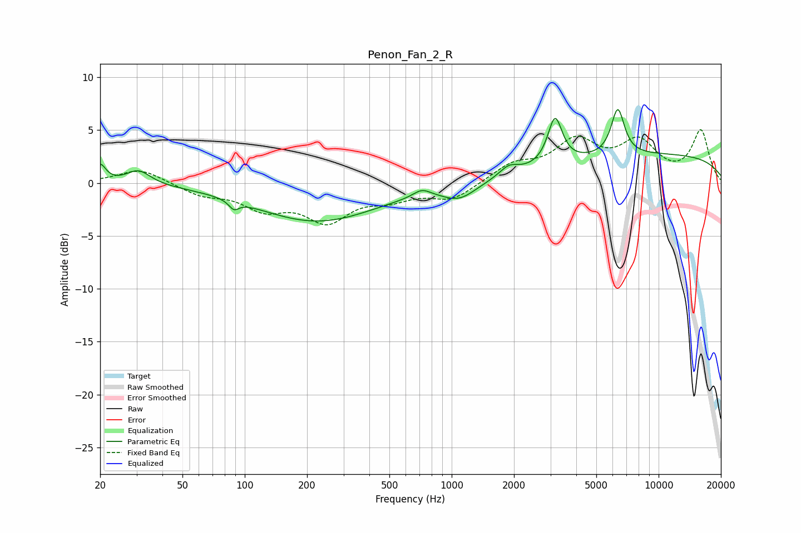

# Penon_Fan_2_R
See [usage instructions](https://github.com/jaakkopasanen/AutoEq#usage) for more options and info.

### Parametric EQs
Apply preamp of -7.1 dB when using parametric equalizer.

|   # | Type    |   Fc (Hz) |    Q |   Gain (dB) |
|-----|---------|-----------|------|-------------|
|   1 | Peaking |        20 | 5.25 |         1.7 |
|   2 | Peaking |        31 | 2.44 |         1.4 |
|   3 | Peaking |        89 | 6    |        -0.8 |
|   4 | Peaking |       223 | 0.48 |        -3.6 |
|   5 | Peaking |       718 | 3.41 |         0.7 |
|   6 | Peaking |      1089 | 1.73 |        -1.4 |
|   7 | Peaking |      1889 | 3.04 |         1   |
|   8 | Peaking |      3158 | 4.11 |         4.4 |
|   9 | Peaking |      6349 | 4.31 |         4.4 |
|  10 | Peaking |     10000 | 0.22 |         2.7 |

### Fixed Band EQs
When using fixed band (also called graphic) equalizer, apply preamp of **-5.1 dB** (if available) and set gains manually with these parameters.

|   # | Type    |   Fc (Hz) |    Q |   Gain (dB) |
|-----|---------|-----------|------|-------------|
|   1 | Peaking |        31 | 1.41 |         1.4 |
|   2 | Peaking |        62 | 1.41 |        -1   |
|   3 | Peaking |       125 | 1.41 |        -2.1 |
|   4 | Peaking |       250 | 1.41 |        -3.3 |
|   5 | Peaking |       500 | 1.41 |        -1.2 |
|   6 | Peaking |      1000 | 1.41 |        -1.5 |
|   7 | Peaking |      2000 | 1.41 |         1.6 |
|   8 | Peaking |      4000 | 1.41 |         3.7 |
|   9 | Peaking |      8000 | 1.41 |         3.5 |
|  10 | Peaking |     16000 | 1.41 |         4.8 |

### Graphs

