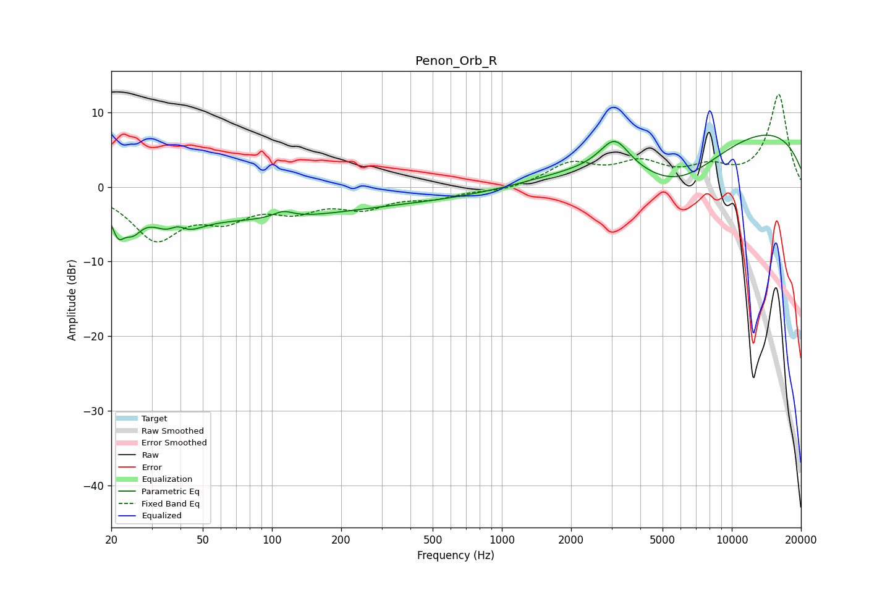

# Penon_Orb_R
See [usage instructions](https://github.com/jaakkopasanen/AutoEq#usage) for more options and info.

### Parametric EQs
Apply preamp of -7.0 dB when using parametric equalizer.

|   # | Type    |   Fc (Hz) |    Q |   Gain (dB) |
|-----|---------|-----------|------|-------------|
|   1 | Peaking |        21 | 5.1  |        -3.5 |
|   2 | Peaking |        25 | 3.72 |        -2.6 |
|   3 | Peaking |        39 | 2.01 |        -5.5 |
|   4 | Peaking |        39 | 3.3  |         3.5 |
|   5 | Peaking |        83 | 0.33 |        -4   |
|   6 | Peaking |       112 | 3.32 |         0.9 |
|   7 | Peaking |       561 | 0.42 |        -1.3 |
|   8 | Peaking |      3096 | 2.2  |         4.2 |
|   9 | Peaking |      5791 | 0.62 |        -7.6 |
|  10 | Peaking |      9428 | 0.21 |         9.4 |

### Fixed Band EQs
When using fixed band (also called graphic) equalizer, apply preamp of **-12.5 dB** (if available) and set gains manually with these parameters.

|   # | Type    |   Fc (Hz) |    Q |   Gain (dB) |
|-----|---------|-----------|------|-------------|
|   1 | Peaking |        31 | 1.41 |        -6.6 |
|   2 | Peaking |        62 | 1.41 |        -3.4 |
|   3 | Peaking |       125 | 1.41 |        -2.6 |
|   4 | Peaking |       250 | 1.41 |        -2.4 |
|   5 | Peaking |       500 | 1.41 |        -1.2 |
|   6 | Peaking |      1000 | 1.41 |        -0.6 |
|   7 | Peaking |      2000 | 1.41 |         3   |
|   8 | Peaking |      4000 | 1.41 |         2.8 |
|   9 | Peaking |      8000 | 1.41 |         2.1 |
|  10 | Peaking |     16000 | 1.41 |        12.4 |

### Graphs

