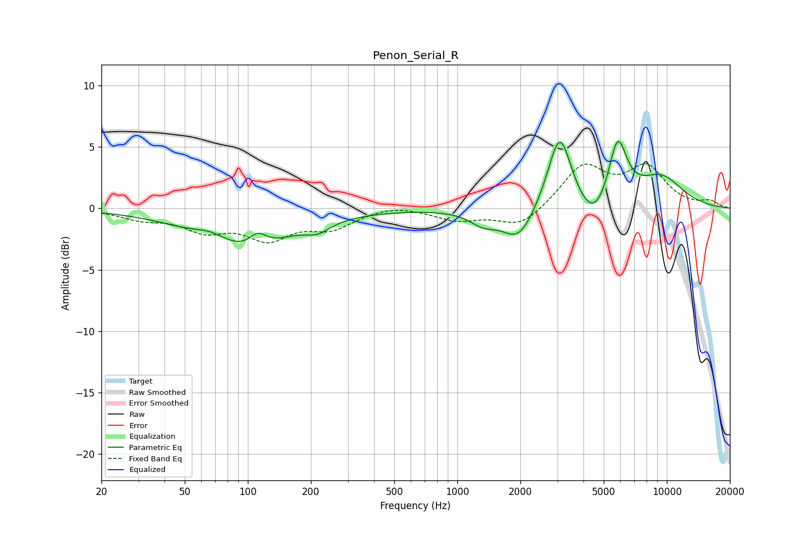

# Penon_Serial_R
See [usage instructions](https://github.com/jaakkopasanen/AutoEq#usage) for more options and info.

### Parametric EQs
Apply preamp of -5.5 dB when using parametric equalizer.

|   # | Type    |   Fc (Hz) |    Q |   Gain (dB) |
|-----|---------|-----------|------|-------------|
|   1 | Peaking |        67 | 1.76 |         0.9 |
|   2 | Peaking |        94 | 0.62 |        -3.4 |
|   3 | Peaking |       112 | 3.61 |         1   |
|   4 | Peaking |       216 | 2.57 |        -0.7 |
|   5 | Peaking |      1329 | 2.17 |        -1   |
|   6 | Peaking |      1959 | 1.86 |        -2.7 |
|   7 | Peaking |      3082 | 2.48 |         6.4 |
|   8 | Peaking |      4492 | 1.83 |        -2.4 |
|   9 | Peaking |      5820 | 3.09 |         5.3 |
|  10 | Peaking |      9344 | 1.12 |         2.5 |

### Fixed Band EQs
When using fixed band (also called graphic) equalizer, apply preamp of **-3.7 dB** (if available) and set gains manually with these parameters.

|   # | Type    |   Fc (Hz) |    Q |   Gain (dB) |
|-----|---------|-----------|------|-------------|
|   1 | Peaking |        31 | 1.41 |        -0.7 |
|   2 | Peaking |        62 | 1.41 |        -1.6 |
|   3 | Peaking |       125 | 1.41 |        -2.2 |
|   4 | Peaking |       250 | 1.41 |        -1.4 |
|   5 | Peaking |       500 | 1.41 |         0.4 |
|   6 | Peaking |      1000 | 1.41 |        -0.9 |
|   7 | Peaking |      2000 | 1.41 |        -1.6 |
|   8 | Peaking |      4000 | 1.41 |         3.4 |
|   9 | Peaking |      8000 | 1.41 |         3.1 |
|  10 | Peaking |     16000 | 1.41 |         0.5 |

### Graphs

