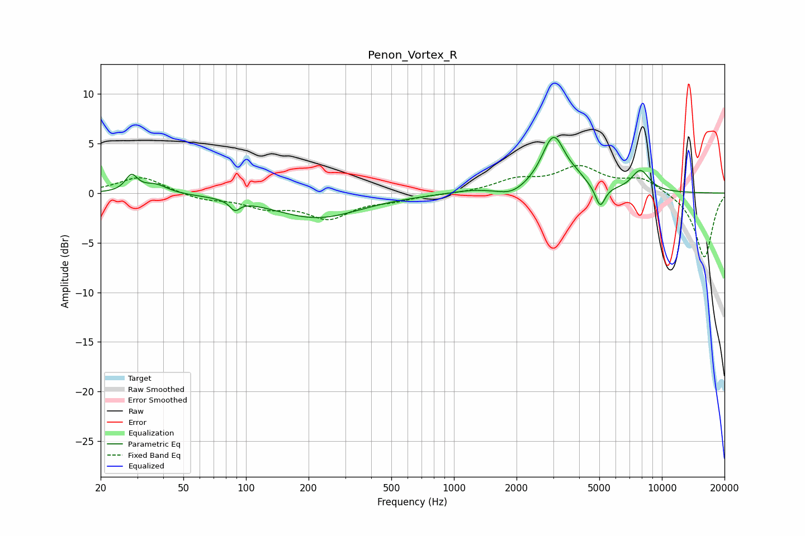

# Penon_Vortex_R
See [usage instructions](https://github.com/jaakkopasanen/AutoEq#usage) for more options and info.

### Parametric EQs
Apply preamp of -5.7 dB when using parametric equalizer.

|   # | Type    |   Fc (Hz) |    Q |   Gain (dB) |
|-----|---------|-----------|------|-------------|
|   1 | Peaking |        28 | 4.93 |         1.7 |
|   2 | Peaking |        37 | 2.53 |         0.9 |
|   3 | Peaking |        88 | 6    |        -1   |
|   4 | Peaking |       219 | 0.67 |        -2.5 |
|   5 | Peaking |      1225 | 1.39 |         0.3 |
|   6 | Peaking |      1892 | 2.24 |        -0.7 |
|   7 | Peaking |      3014 | 2.46 |         5.6 |
|   8 | Peaking |      3904 | 3.25 |         0.6 |
|   9 | Peaking |      5053 | 6    |        -2.1 |
|  10 | Peaking |      7882 | 3    |         2.2 |

### Fixed Band EQs
When using fixed band (also called graphic) equalizer, apply preamp of **-2.9 dB** (if available) and set gains manually with these parameters.

|   # | Type    |   Fc (Hz) |    Q |   Gain (dB) |
|-----|---------|-----------|------|-------------|
|   1 | Peaking |        31 | 1.41 |         1.7 |
|   2 | Peaking |        62 | 1.41 |        -0.6 |
|   3 | Peaking |       125 | 1.41 |        -1.3 |
|   4 | Peaking |       250 | 1.41 |        -2.4 |
|   5 | Peaking |       500 | 1.41 |        -0.6 |
|   6 | Peaking |      1000 | 1.41 |        -0.1 |
|   7 | Peaking |      2000 | 1.41 |         1.2 |
|   8 | Peaking |      4000 | 1.41 |         2.4 |
|   9 | Peaking |      8000 | 1.41 |         1.4 |
|  10 | Peaking |     16000 | 1.41 |        -6.6 |

### Graphs

