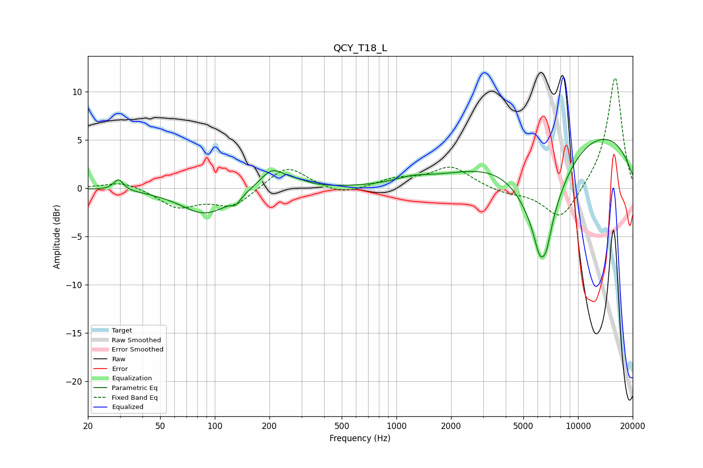

# QCY_T18_L
See [usage instructions](https://github.com/jaakkopasanen/AutoEq#usage) for more options and info.

### Parametric EQs
Apply preamp of -5.2 dB when using parametric equalizer.

|   # | Type    |   Fc (Hz) |    Q |   Gain (dB) |
|-----|---------|-----------|------|-------------|
|   1 | Peaking |        29 | 5.45 |         1.2 |
|   2 | Peaking |        89 | 1.05 |        -2.7 |
|   3 | Peaking |       131 | 5.69 |        -0.7 |
|   4 | Peaking |       207 | 1.94 |         2.2 |
|   5 | Peaking |       287 | 2.36 |         0.4 |
|   6 | Peaking |      1223 | 1.57 |         0.5 |
|   7 | Peaking |      6160 | 4.79 |        -2.4 |
|   8 | Peaking |      6335 | 1.14 |        -9.9 |
|   9 | Peaking |      6695 | 5.37 |        -1.9 |
|  10 | Peaking |      9711 | 0.25 |         6.8 |

### Fixed Band EQs
When using fixed band (also called graphic) equalizer, apply preamp of **-11.5 dB** (if available) and set gains manually with these parameters.

|   # | Type    |   Fc (Hz) |    Q |   Gain (dB) |
|-----|---------|-----------|------|-------------|
|   1 | Peaking |        31 | 1.41 |         0.8 |
|   2 | Peaking |        62 | 1.41 |        -1.9 |
|   3 | Peaking |       125 | 1.41 |        -1.9 |
|   4 | Peaking |       250 | 1.41 |         2.4 |
|   5 | Peaking |       500 | 1.41 |        -0.8 |
|   6 | Peaking |      1000 | 1.41 |         0.9 |
|   7 | Peaking |      2000 | 1.41 |         2.2 |
|   8 | Peaking |      4000 | 1.41 |        -0.5 |
|   9 | Peaking |      8000 | 1.41 |        -3.5 |
|  10 | Peaking |     16000 | 1.41 |        11.7 |

### Graphs

