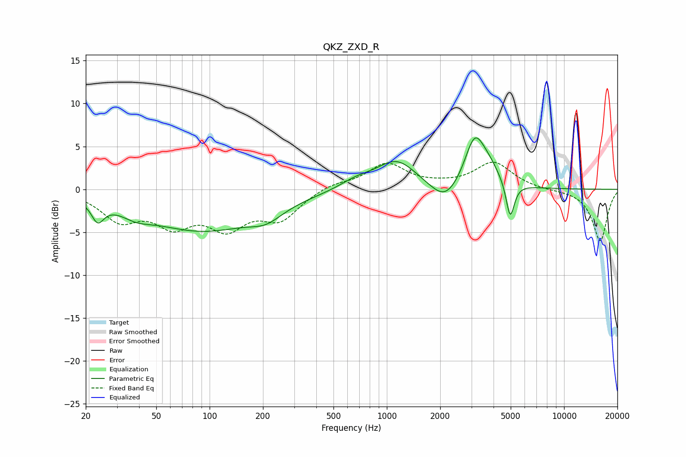

# QKZ_ZXD_R
See [usage instructions](https://github.com/jaakkopasanen/AutoEq#usage) for more options and info.

### Parametric EQs
Apply preamp of -6.1 dB when using parametric equalizer.

|   # | Type    |   Fc (Hz) |    Q |   Gain (dB) |
|-----|---------|-----------|------|-------------|
|   1 | Peaking |        23 | 4.03 |        -2.3 |
|   2 | Peaking |        38 | 1.69 |        -1   |
|   3 | Peaking |        91 | 0.43 |        -4.7 |
|   4 | Peaking |       208 | 1.57 |        -1.3 |
|   5 | Peaking |       670 | 1.54 |         0.9 |
|   6 | Peaking |      1135 | 1.23 |         3.4 |
|   7 | Peaking |      2135 | 1.72 |        -2.5 |
|   8 | Peaking |      3127 | 2.48 |         5.5 |
|   9 | Peaking |      3763 | 2.12 |         1.8 |
|  10 | Peaking |      4969 | 6    |        -4.3 |

### Fixed Band EQs
When using fixed band (also called graphic) equalizer, apply preamp of **-3.3 dB** (if available) and set gains manually with these parameters.

|   # | Type    |   Fc (Hz) |    Q |   Gain (dB) |
|-----|---------|-----------|------|-------------|
|   1 | Peaking |        31 | 1.41 |        -3.3 |
|   2 | Peaking |        62 | 1.41 |        -3.5 |
|   3 | Peaking |       125 | 1.41 |        -3.9 |
|   4 | Peaking |       250 | 1.41 |        -3.2 |
|   5 | Peaking |       500 | 1.41 |         0.7 |
|   6 | Peaking |      1000 | 1.41 |         2.9 |
|   7 | Peaking |      2000 | 1.41 |         0.3 |
|   8 | Peaking |      4000 | 1.41 |         3.1 |
|   9 | Peaking |      8000 | 1.41 |        -0.1 |
|  10 | Peaking |     16000 | 1.41 |        -6   |

### Graphs

