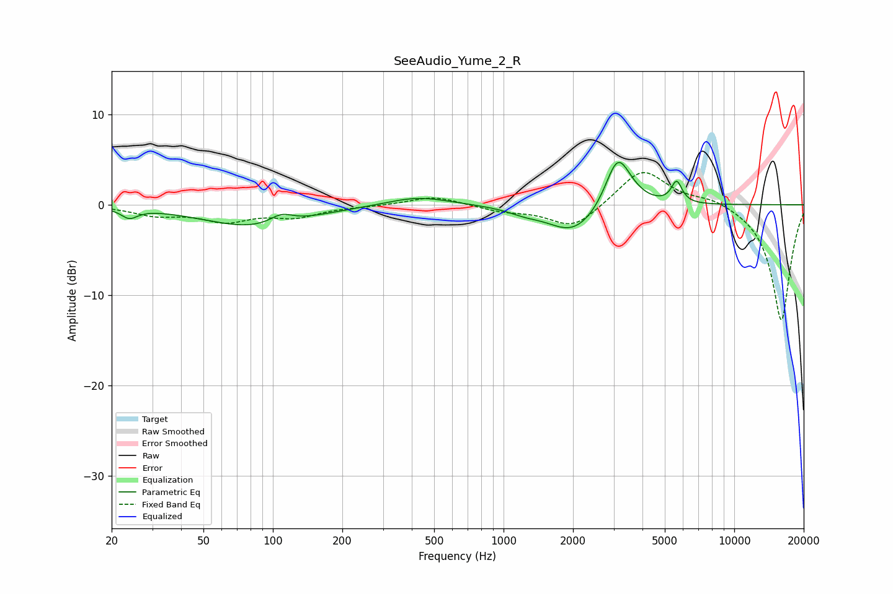

# SeeAudio_Yume_2_R
See [usage instructions](https://github.com/jaakkopasanen/AutoEq#usage) for more options and info.

### Parametric EQs
Apply preamp of -4.8 dB when using parametric equalizer.

|   # | Type    |   Fc (Hz) |    Q |   Gain (dB) |
|-----|---------|-----------|------|-------------|
|   1 | Peaking |        24 | 4.06 |        -1.1 |
|   2 | Peaking |        84 | 0.63 |        -2.5 |
|   3 | Peaking |       109 | 2.83 |         1.1 |
|   4 | Peaking |       426 | 1.05 |         1   |
|   5 | Peaking |      1233 | 1.96 |        -0.5 |
|   6 | Peaking |      1968 | 1.37 |        -2.5 |
|   7 | Peaking |      2433 | 1.04 |        -1.1 |
|   8 | Peaking |      3112 | 2.61 |         5.4 |
|   9 | Peaking |      3367 | 1.89 |         1   |
|  10 | Peaking |      5627 | 6    |         2.4 |

### Fixed Band EQs
When using fixed band (also called graphic) equalizer, apply preamp of **-3.7 dB** (if available) and set gains manually with these parameters.

|   # | Type    |   Fc (Hz) |    Q |   Gain (dB) |
|-----|---------|-----------|------|-------------|
|   1 | Peaking |        31 | 1.41 |        -1   |
|   2 | Peaking |        62 | 1.41 |        -1.7 |
|   3 | Peaking |       125 | 1.41 |        -1.2 |
|   4 | Peaking |       250 | 1.41 |        -0.1 |
|   5 | Peaking |       500 | 1.41 |         1   |
|   6 | Peaking |      1000 | 1.41 |        -0.6 |
|   7 | Peaking |      2000 | 1.41 |        -2.7 |
|   8 | Peaking |      4000 | 1.41 |         4.1 |
|   9 | Peaking |      8000 | 1.41 |         0.8 |
|  10 | Peaking |     16000 | 1.41 |       -12.9 |

### Graphs

