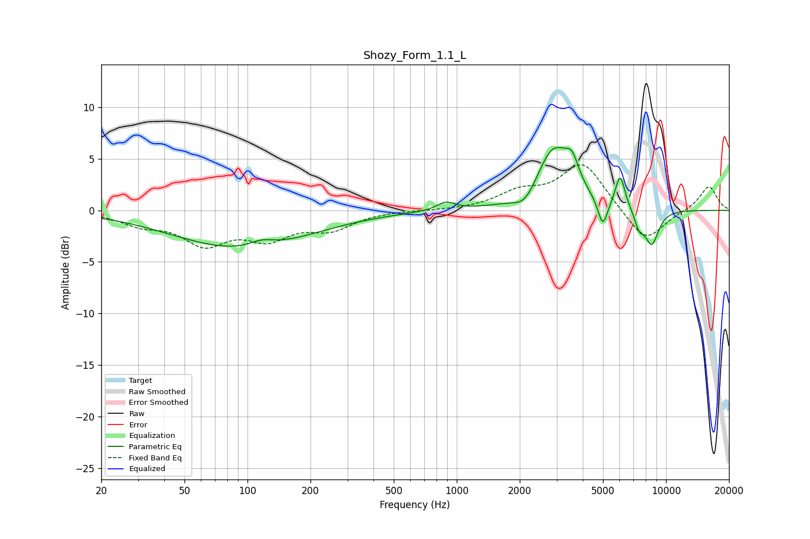

# Shozy_Form_1.1_L
See [usage instructions](https://github.com/jaakkopasanen/AutoEq#usage) for more options and info.

### Parametric EQs
Apply preamp of -6.2 dB when using parametric equalizer.

|   # | Type    |   Fc (Hz) |    Q |   Gain (dB) |
|-----|---------|-----------|------|-------------|
|   1 | Peaking |        93 | 0.44 |        -3.7 |
|   2 | Peaking |       117 | 2.38 |         0.7 |
|   3 | Peaking |       888 | 3.27 |         0.8 |
|   4 | Peaking |      2124 | 2.58 |        -1.6 |
|   5 | Peaking |      2900 | 1.68 |         6   |
|   6 | Peaking |      3559 | 4.43 |         2.1 |
|   7 | Peaking |      4988 | 6    |        -2.7 |
|   8 | Peaking |      6043 | 5.91 |         3.2 |
|   9 | Peaking |      7449 | 5.97 |        -1.5 |
|  10 | Peaking |      8545 | 3.84 |        -3.4 |

### Fixed Band EQs
When using fixed band (also called graphic) equalizer, apply preamp of **-4.5 dB** (if available) and set gains manually with these parameters.

|   # | Type    |   Fc (Hz) |    Q |   Gain (dB) |
|-----|---------|-----------|------|-------------|
|   1 | Peaking |        31 | 1.41 |        -1.2 |
|   2 | Peaking |        62 | 1.41 |        -3   |
|   3 | Peaking |       125 | 1.41 |        -2.4 |
|   4 | Peaking |       250 | 1.41 |        -1.6 |
|   5 | Peaking |       500 | 1.41 |         0   |
|   6 | Peaking |      1000 | 1.41 |        -0   |
|   7 | Peaking |      2000 | 1.41 |         1.6 |
|   8 | Peaking |      4000 | 1.41 |         4.6 |
|   9 | Peaking |      8000 | 1.41 |        -3.2 |
|  10 | Peaking |     16000 | 1.41 |         2.4 |

### Graphs

