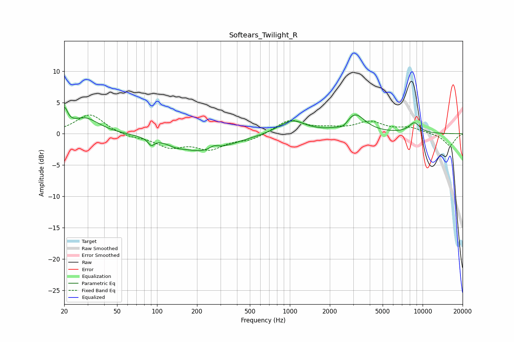

# Softears_Twilight_R
See [usage instructions](https://github.com/jaakkopasanen/AutoEq#usage) for more options and info.

### Parametric EQs
Apply preamp of -4.3 dB when using parametric equalizer.

|   # | Type    |   Fc (Hz) |    Q |   Gain (dB) |
|-----|---------|-----------|------|-------------|
|   1 | Peaking |        20 | 5.83 |         3   |
|   2 | Peaking |        29 | 1.35 |         2.5 |
|   3 | Peaking |        90 | 5.99 |        -1.1 |
|   4 | Peaking |       139 | 2.48 |        -0.5 |
|   5 | Peaking |       225 | 0.7  |        -2.8 |
|   6 | Peaking |       268 | 3.99 |         0.7 |
|   7 | Peaking |      1035 | 1.42 |         2.2 |
|   8 | Peaking |      2546 | 3.53 |        -0.9 |
|   9 | Peaking |      3076 | 1.86 |         3.2 |
|  10 | Peaking |      8663 | 3.04 |         1.6 |

### Fixed Band EQs
When using fixed band (also called graphic) equalizer, apply preamp of **-3.1 dB** (if available) and set gains manually with these parameters.

|   # | Type    |   Fc (Hz) |    Q |   Gain (dB) |
|-----|---------|-----------|------|-------------|
|   1 | Peaking |        31 | 1.41 |         3.2 |
|   2 | Peaking |        62 | 1.41 |        -0.5 |
|   3 | Peaking |       125 | 1.41 |        -1.9 |
|   4 | Peaking |       250 | 1.41 |        -2.2 |
|   5 | Peaking |       500 | 1.41 |        -0.9 |
|   6 | Peaking |      1000 | 1.41 |         2.2 |
|   7 | Peaking |      2000 | 1.41 |         0.6 |
|   8 | Peaking |      4000 | 1.41 |         1.8 |
|   9 | Peaking |      8000 | 1.41 |         0.9 |
|  10 | Peaking |     16000 | 1.41 |        -1.9 |

### Graphs

