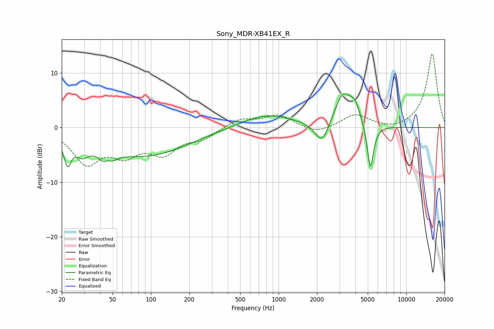

# Sony_MDR-XB41EX_R
See [usage instructions](https://github.com/jaakkopasanen/AutoEq#usage) for more options and info.

### Parametric EQs
Apply preamp of -6.3 dB when using parametric equalizer.

|   # | Type    |   Fc (Hz) |    Q |   Gain (dB) |
|-----|---------|-----------|------|-------------|
|   1 | Peaking |        22 | 4.93 |        -4.7 |
|   2 | Peaking |        29 | 2.7  |        -2.6 |
|   3 | Peaking |        45 | 3.16 |        -5.7 |
|   4 | Peaking |        46 | 4.53 |         3.6 |
|   5 | Peaking |        91 | 0.42 |        -5.1 |
|   6 | Peaking |       813 | 0.67 |         2.5 |
|   7 | Peaking |      2193 | 2.57 |        -4.2 |
|   8 | Peaking |      3189 | 2.14 |         6   |
|   9 | Peaking |      3977 | 3.38 |         2.9 |
|  10 | Peaking |      5242 | 5.53 |        -8.6 |

### Fixed Band EQs
When using fixed band (also called graphic) equalizer, apply preamp of **-13.6 dB** (if available) and set gains manually with these parameters.

|   # | Type    |   Fc (Hz) |    Q |   Gain (dB) |
|-----|---------|-----------|------|-------------|
|   1 | Peaking |        31 | 1.41 |        -6.1 |
|   2 | Peaking |        62 | 1.41 |        -4.1 |
|   3 | Peaking |       125 | 1.41 |        -4.2 |
|   4 | Peaking |       250 | 1.41 |        -1.8 |
|   5 | Peaking |       500 | 1.41 |         1.6 |
|   6 | Peaking |      1000 | 1.41 |         2.2 |
|   7 | Peaking |      2000 | 1.41 |        -1.2 |
|   8 | Peaking |      4000 | 1.41 |         2.4 |
|   9 | Peaking |      8000 | 1.41 |        -0.6 |
|  10 | Peaking |     16000 | 1.41 |        13.6 |

### Graphs

