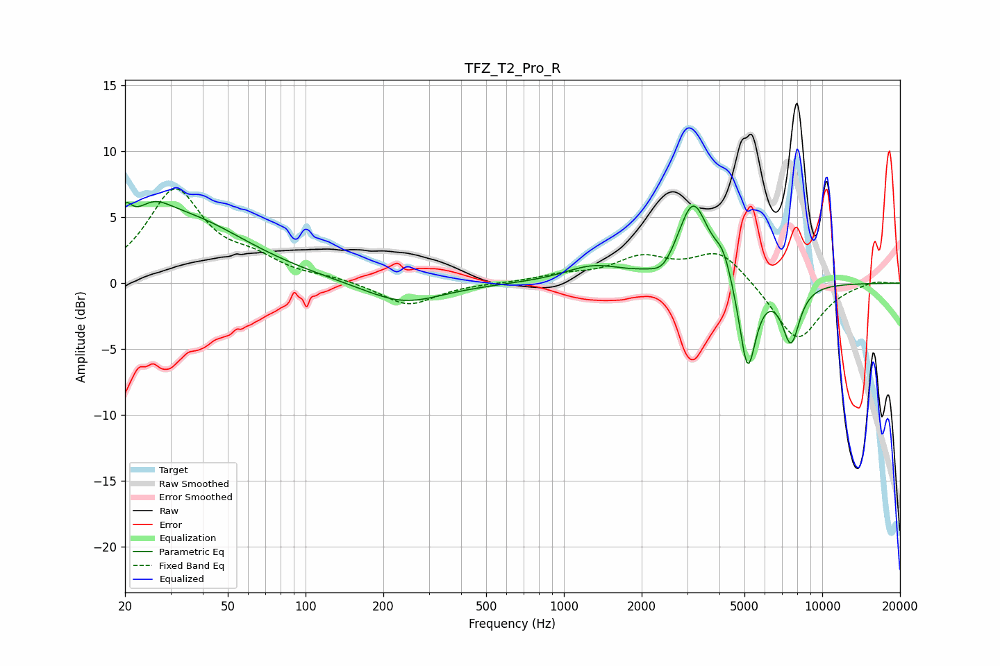

# TFZ_T2_Pro_R
See [usage instructions](https://github.com/jaakkopasanen/AutoEq#usage) for more options and info.

### Parametric EQs
Apply preamp of -6.3 dB when using parametric equalizer.

|   # | Type    |   Fc (Hz) |    Q |   Gain (dB) |
|-----|---------|-----------|------|-------------|
|   1 | Peaking |        20 | 5.9  |         1.8 |
|   2 | Peaking |        26 | 2.06 |         1.6 |
|   3 | Peaking |        33 | 0.57 |         4.8 |
|   4 | Peaking |       239 | 0.94 |        -1.6 |
|   5 | Peaking |      1297 | 1.26 |         1.2 |
|   6 | Peaking |      2425 | 3.29 |        -1   |
|   7 | Peaking |      3164 | 2.35 |         6.1 |
|   8 | Peaking |      4136 | 4.13 |         1.7 |
|   9 | Peaking |      5141 | 4.25 |        -7   |
|  10 | Peaking |      7563 | 3.89 |        -4.4 |

### Fixed Band EQs
When using fixed band (also called graphic) equalizer, apply preamp of **-7.3 dB** (if available) and set gains manually with these parameters.

|   # | Type    |   Fc (Hz) |    Q |   Gain (dB) |
|-----|---------|-----------|------|-------------|
|   1 | Peaking |        31 | 1.41 |         6.9 |
|   2 | Peaking |        62 | 1.41 |         1.4 |
|   3 | Peaking |       125 | 1.41 |         0.3 |
|   4 | Peaking |       250 | 1.41 |        -1.7 |
|   5 | Peaking |       500 | 1.41 |        -0   |
|   6 | Peaking |      1000 | 1.41 |         0.5 |
|   7 | Peaking |      2000 | 1.41 |         1.8 |
|   8 | Peaking |      4000 | 1.41 |         2.5 |
|   9 | Peaking |      8000 | 1.41 |        -4.5 |
|  10 | Peaking |     16000 | 1.41 |         0.3 |

### Graphs

